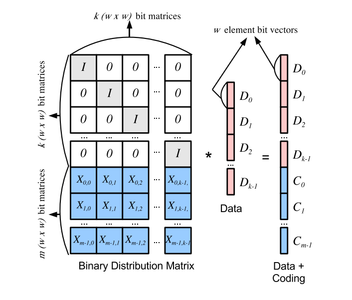

# **SIMD in Ceph**

[TOC]

## 关于工具：Jerasure Version 2.0

### 简介：

&emsp;Jerasue这个库是由James S. Plank先生实现的，是一个实现纠删码的C语言仓库。并且，2.0版本在实现伽罗华域运算的后端时，采用了GF-Complete算法库，同时还采用了Intel SIMD指令集来加速RS编解码过程。

​	源代码地址：https://github.com/ceph/jerasure

### 我们想做的

​	Ceph纠删码实现中的SIMD加速

&emsp;目前只是在阅读Plank先生的代码，希望以后可以应用在ceph纠删码中。

## 4.26 

### Jerasure Libary 的组成模块

1. **galois.h/galois.c**:

   这是给GF-Complete做的一层包装，从而可以继续使用jerasure version1.2的界面

2. **jerasure.h/jerasure.c**:

   这个模块是核心代码，并且只依赖于**galois**模块。这个模块的功能是支持对基于矩阵的编码和解码，基于位矩阵的编码和解码，位矩阵到调度的转换，矩阵和位矩阵求逆的支持。(来源于谷歌翻译，具体下周看了源代码再说）

3. **reed sol.h/reed sol.c:**

   用于为Reed-Solomon编码创建生成矩阵，还包括针对RAID-6的Reed-Solomon编码的优化版本。

4. **cauchy.h/cauchy.c:**

   这个模块用于生成柯西RS编码生成矩阵[BKK+95, PX06]，也支持为RAID-6创建最佳Cauchy发生矩阵。
   
5. **liberation.h/liberation.c:**

   These are procedures for performing RAID-6 coding and decoding with minimal
   density MDS codes [PBV11] — the RAID-6 Liberation codes [Pla08], Blaum-Roth codes [BR99] and the
   RAID-6 Liber8tion code [Pla09]. (抱歉，看不懂)

## 4.28

### 纠删码编解码的原理：

​	**分布矩阵**的前k行组成k×k单位矩阵。剩余的m行称为编码矩阵，并以各种方式定义[Rab89，Pre89，BKK 95，PD05]。如下面Figure 3所示：

​	分布矩阵乘以数据字组成的向量D，并产生包含原数据和编码字的乘积向量。因此，为了编码，我们需要用数据执行分布矩阵的点积。

​	为了**解码**，我们注意到系统中的每个单词都有一个相应的分布矩阵行。当设备发生故障时，我们从分布的k行创建一个解码矩阵，该矩阵对应于非故障设备。请注意，此k行的解码矩阵乘以原始数据等于剩余的k个幸存者。如果我们对这个矩阵求逆并将其乘以等式的两边，就求出了原始数据。

### 位矩阵编码原理：

​	位编码矩阵最初是在原始的Cauchy Reed-Solomon编码论文上的[BKK 95]。为了使用位矩阵进行编码和解码，我们在每个方向上将原来的分布矩阵扩展了w倍，位矩阵的分布矩阵规模是w(k + m) × wk，称为二元分布矩阵。将其乘以wk元素向量，该向量由来自k个数据设备的w位组成，如下所示：

​	其中，原来的分布矩阵每一个元素现在都变成了一个w*w的方阵，D向量的每个数据块都是一个w位的向量。

​	与GF（2w）中的矩阵向量乘积一样，乘积的每一行对应于**二元分布矩阵**的一行，并且为该行和数据向量的点积。由于所有元素都是位，我们可以通过获取矩阵行中元素为1的每个数据位的**XOR**来执行点积。换句话说，我们不是通过加法和乘法来执行点积，而是仅使用XOR执行它。**该点积的性能(计算量)与行中的1的数量直接相关**。因此，我们有必要找到1比较少的分布矩阵。使用位矩阵进行解码与GF（2w）上的矩阵相同，除了现在每个设备对应于矩阵的w行，而不是一行。还要记住，上述说明中的w位可能对应于实现中的一个数据包。

### 使用schedule(列表)而不是位矩阵

​	如上所述，由于最终找到的分布矩阵比较稀疏，这里采用五元组列表的数据结构来表示用分布矩阵来编码，采用预编译的方式来增加编码效率：

​																	**< op, sd, sb, dd, db >**

​	其中op是操作码：0表示复制，1表示XOR，sd是源设备的id，sb是源设备的位。最后两个元素dd和db是目标设备和位。按照惯例，我们使用从0到k+m -1的整数来编号设备.用i(0<=i <k)标识数据设备Di，并且用i(k+m>i≥k)标识编码设备Ci-k。

​	上面是使用5-tuples数据结构编译如上的二元分布矩阵的示例，其中k=3,w=5。

作者：刘硕 
