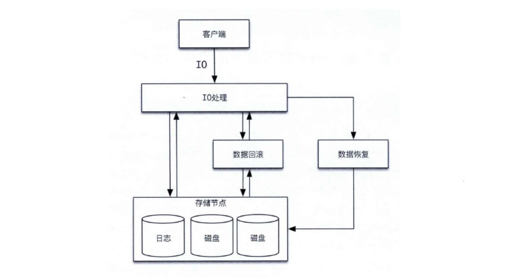
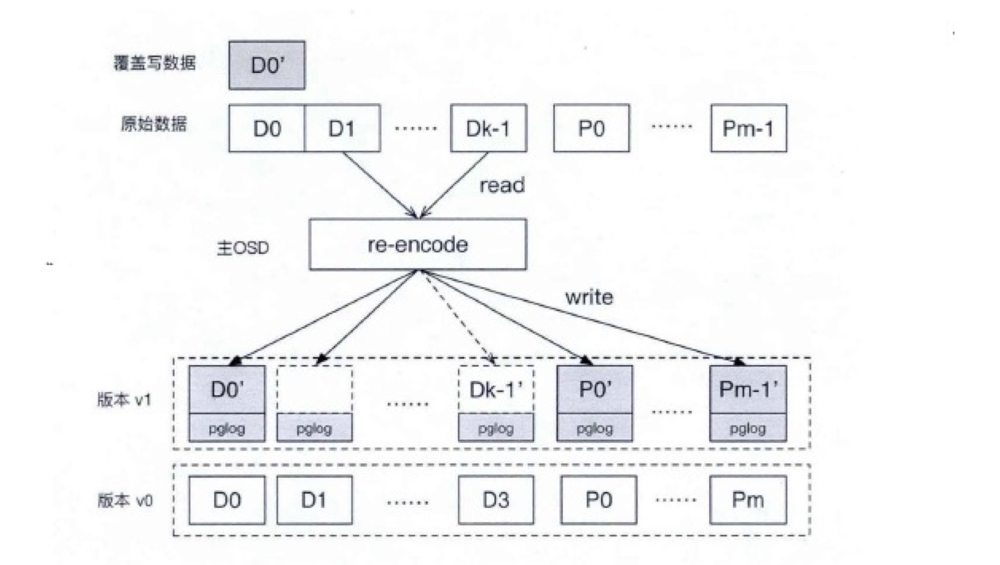
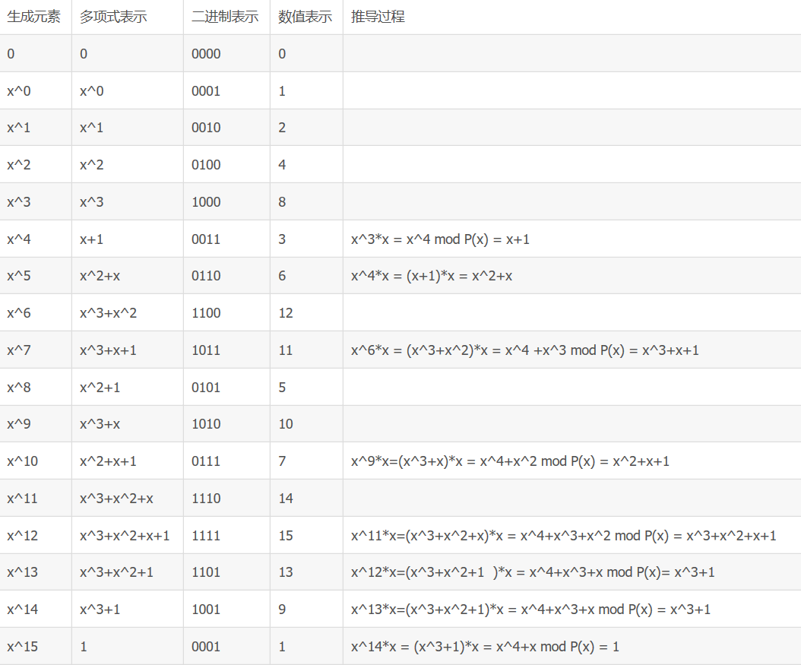

# 可行性报告


- [可行性报告](#可行性报告)
    - [项目简介](#项目简介)
    - [项目背景](#项目背景)
        - [分布式系统中的CAP理论](#分布式系统中的cap理论)
        - [纠删码](#纠删码)
            - [纠删码简介](#纠删码简介)
            - [纠删码的重要性](#纠删码的重要性)
        - [CEPH在I/O上存在的问题](#ceph在io上存在的问题)
        - [纠删码的覆盖写实现](#纠删码的覆盖写实现)
    - [覆盖写](#覆盖写)
        - [覆盖写的理论依据](#覆盖写的理论依据)
        - [覆盖写的技术依据](#覆盖写的技术依据)
            - [设计思路](#设计思路)
            - [方案](#方案)
    - [纠删码的柯西RS编码](#纠删码的柯西rs编码)
        - [柯西code在复杂性上的优化](#柯西code在复杂性上的优化)
            - [重要改进点：](#重要改进点)
            - [柯西编解码过程优化](#柯西编解码过程优化)
        - [柯西code的算法可行性](#柯西code的算法可行性)
            - [伽罗华域的四则运算](#伽罗华域的四则运算)
                - [有限域GF(2^w )](#有限域gf2^w-)
                - [GF（2^w ）上的多项式运算](#gf2^w-上的多项式运算)
                - [本原多项式](#本原多项式)
                - [通过本原多项式生成元素算法](#通过本原多项式生成元素算法)
                - [伽罗华域上的运算](#伽罗华域上的运算)
            - [柯西code在纠删码中的应用](#柯西code在纠删码中的应用)
                - [纠删码的三个重要参数](#纠删码的三个重要参数)
                - [生成冗余](#生成冗余)
                - [恢复原始数据](#恢复原始数据)
    - [SIMD](#simd)
        - [背景](#背景)
        - [SIMD优点](#simd优点)
        - [使用方案](#使用方案)
        - [SIMD与纠删码的结合](#simd与纠删码的结合)
        - [可用库-Vc library](#可用库-vc-library)
            - [简介](#简介)
            - [建造和安装VC](#建造和安装vc)
            - [文档](#文档)
    - [案例分析](#案例分析)
        - [增加对小文件读取的IO项目————cephfs_readline](#增加对小文件读取的io项目cephfs_readline)
            - [项目简介](#项目简介-1)
                - [原始方案](#原始方案)
                    - [总结](#总结)
                - [优化方案](#优化方案)
                    - [总结](#总结-1)
        - [基于上述项目，我们提出的基于Ceph的小文件处理方案](#基于上述项目我们提出的基于ceph的小文件处理方案)
            - [写小文件](#写小文件)
            - [读小文件](#读小文件)
            - [删除小文件](#删除小文件)
            - [软硬件结合优化](#软硬件结合优化)
            - [减少ceph读取小文件的IO深度](#减少ceph读取小文件的io深度)
            - [对不同的object去制定不同的Crush算法](#对不同的object去制定不同的crush算法)
    - [参考文献](#参考文献)


## 项目简介
基于Ceph，实现纠删码的使用和改进。具体的实现如下：  
在分块数量固定、每块512字节的存储格式上，使用柯西编解码方式，利用SIMD指令集加速数据的计算，实现类APFS以增量方式修改和写数据的功能，最后在有条件的情况下考虑文件的分布存储位置优化问题，通过冷热数据分层为其分配不同比例的数据块和校验块，实现更好的容错机制，从而达到对可用性的要求。

## 项目背景
### 分布式系统中的CAP理论
CAP原则又称CAP定理，指的是在一个分布式系统中， Consistency（一致性）、 Availability（可用性）、Partition tolerance（分区容错性），三者不可得兼。  
CAP原则是NOSQL数据库的基石。
分布式系统的CAP理论：理论首先把分布式系统中的三个特性进行了如下归纳：  

1. 一致性（C）：在分布式系统中的所有数据备份，在同一时刻是否同样的值。（等同于所有节点访问同一份最新的数据副本）
2. 可用性（A）：在集群中一部分节点故障后，集群整体是否还能响应客户端的读写请求。（对数据更新具备高可用性）
3. 分区容忍性（P）：以实际效果而言，分区相当于对通信的时限要求。系统如果不能在时限内达成数据一致性，就意味着发生了分区的情况，必须就当前操作在C和A之间做出选择。  

### 纠删码

#### 纠删码简介
分布式系统需要在硬件失效等故障发生后仍然能继续提供服务。就数据而言，HDFS采用每份数据3副本的方式，保证某些数据损失之后仍能继续使用。数据的容错除了副本还有另一种做法，就是把丢失的数据计算出来。这就是纠删码（erasure coding，EC）的思想了。它将数据分割成片段，把冗余数据块扩展、编码，并将其存储在不同的位置，比如磁盘、存储节点或者其它地理位置。

#### 纠删码的重要性
数据的爆炸式增长使得存储系统的规模不断增加，存储设备的可靠性却一直没有得到显著提高（SSD 从SLC 到MLC 和TLC 可靠性不断下降，磁盘随着单位面积写入数据更多导致可靠性无法提升），从而给数据的持久化存储带来巨大挑战。另外随着存储系统规模的增大，存储系统中的冷数据的增加将远超过热数据的增加，如何安全保存冷数据，在需要的时候能够获取冷数据也成为存储系统中的重要挑战。而纠删码对上述的问题都有较好的解决，因此在当下提及并改进纠删码的技术是有很强的实际意义的。

### CEPH在I/O上存在的问题
在ceph中进行数据的读写时存在读写IO路径过长的问题，这个问题在Ceph的客户端和服务器端都存在。以osd为例，一个IO需要经过message、OSD、FileJournal、FileStore多个模块才能完成，每个模块之间都涉及到队列和线程切换，部分模块在对IO进行处理时还要进行内存拷贝，导致整体性能不高。

### 纠删码的覆盖写实现
在调研报告中已经描述了恢复数据时的复杂性和性能劣势，纠删码由于需要K块数据才能完整还原原始数据，所以在分布式系统中对数据一致性的实现有特殊要求。采用（k，m）的纠删码，即原始数据切片k块，编码出m块校验块，分别存储在k+m个节点中。对于纠删码覆盖写，需要至少m+1个节点的参与，包括1个数据节点，m个校验块节点，当覆盖数据范围变大时，需要的节点也会更多。而（k，m）纠删码至多容忍m个节点的丢失，也就是需要k个节点才能解码原始数据，所以覆盖写更新需要保持至少k个节点数据版本一致。

## 覆盖写
### 覆盖写的理论依据
纠删码的每次修改，涉及到数据块的更新和校验块的更新，数据块的更新替换对应偏移数据即可，校验块的相对复杂，大致分为三种更新方式

1. 全覆盖写（Full stripe writes）：用于写大小是条带大小多倍的情况，全覆盖写不需要读取原有的数据块或者校验块，可以得到最佳的更新性能。处理小块写的一种方式是将多个小块封装为一个装块写。


2. 重构写（Reconstruct writes）：重构写首先读取没有涉及更新的数据块，然后合并覆盖写数据和读取的数据块，计算新的校验块。

3. 增量写（Read-modify writes）：增量写利用了纠删码的线形性，首先读取需要更新的原始数据块，然后计算原始数据块和新块的差值，并应用到校验块，最后需要将更新的数据块和校验块写入对应的位置。


下面用公式来描述利用纠删码线性计算来更新校验块的原理，其中校验块$ P_j $是数据块的线形组合。

$$ P_j = \sum_{x=0}^{k-1}a_{j,x}D_x ,j\in \{0,1,...m-1  \}        \tag 1\\$$

如果覆盖写后数据从$D_i $到$D_i' $,然后每个校验块会根据公式（2）重新构建：

$$ P_j‘ = \sum_{x=0}^{i-1}a_{j,x}D_x +a_{j,x}D_i'+\sum_{x=i+1}^{k-1}a_{j,x}D_x,j\in \{0,1,...m-1  \}        \tag 2\\$$


从公式（1）（2）可以得到：

$$ P_j‘ =P_j+a_{j,i}D_i'- a_{j,i}D_i,j\in \{0,1,...m-1  \}        \tag 3\\$$

根据分配律可以简化得到：

$$ P_j‘ =P_j+a_{j,i}（D_i'- D_i）,j\in \{0,1,...m-1  \}        \tag 4\\$$

从公式（4）可以看出，校验块的更新，需要两次读取原始数据，第一次读取需要更新的原始数据块用于计算和更新数据的差值，第二次读取需要更新的原始校验块，计算和增量之和得到新的校验块。
### 覆盖写的技术依据 
#### 设计思路

纠删码由于其特殊性，每一个数据分片都保存着唯一的数据。通过维护至少k块数据分片，来保持原始数据。而软件定义存储中，通常构建于廉价的通用x86服务器，每个节点，每块硬盘，都会发生故障。纠删码的每一次更新都会至少引入m+1个节点的数据更新，所以保持各数据节点的数据一致性，并且在发生故障时有效的恢复到上一次一致状态就比较困难。



一下根据不同的情况来讨论：

1. 需要更新节点数为m+1个节点的情况：那么原有k-1个节点是一致的，m+1个节点的更新成功也有几种状态，要么没有更新成功，要么至少有1个节点是更新成功了。第一种情况，则所有节点节点都没有更新成功，即写失败，那么所有节点都处于上一个数据一致状态。第二种状态，因为有k-1个节点一致，那么再加上任意一个节点即可以恢复出原始数据。有两种处理方式：
	- 判断更新成功的节点为最新状态，和原来k-1个节点同步数据最新版本号，即为新的数据一致状态，剩余m个未更新成功的节点在下一次同步状态时，会发现版本落后，则需要同步最新版本以及数据；
	- 判断更新失败的节点为最新状态，即判断本次更新失败，那么原来k-1个节点和没有更新的节点都处于数据一致的状态，有数据更新的节点在下一次同步状态时，会发现版本超前，即丢掉本地数据，再去恢复原始数据。

2. 需要更新节点数大于m+1的情况：更新节点变多后，容易出现数据分裂。未参数更新的节点小于k-1个节点，即至少需要2个节点才能恢复出原始数据。当更新节点中，没有2个节点能达成一致状态时，则就会造成数据丢失。进一步概括，当更新数为m+d时，原始数据有k-d个节点，当m+d<2d，即m<d时，就可能会出现更新不一致的情况。考虑一般情况，k会比较大，m会比较小，那么上述情况是比较常见的。综上所述，在分布式系统中，由于硬件等意外因素，要保证数据的可靠性，不在就删码更新中丢失数据，那么纠删码的更新不能像传统多副本一样直接更新在原始的位置。

#### 方案

设计如下的方案：

1. 客户端发出请求到主节点；
2. 主节点读取编码条带中重构新校验块需要读取的数据；
3. 主节点发送可写数据，各数据块节点将新的写操作放队列，进入准备提交阶段；
4. 所有节点准备完成后，主节点即回复客户端写完成；
5. 主节点发送后并请求到所有参与修改的节点，完成最终的写操作；


在准备阶段，覆盖写的数据写入临时对象来持久化，写操作信息进入准备提交的队列。在合并阶段，利用ObjectStore层的原子操作将临时对象数据合并到原属数据块。  

采用这样的两阶段提交，可以不破坏原始数据，保持数据更新的一致性。在准备阶段，所有参与更新的阶段接收写操作和写数据，所有节点回复完后，主节点即判断所有节点都成功接受了请求，即达到更新一致状态然后返回；在合并阶段，主节点发送合并请求，所有节点通过原子性事务来合并，原子性事务可以保证单个节点的合并完全完成或者完全不完成，在容忍m个节点失效的情况下，剩余至少k个节点一定都会保证在最新状态，即可以恢复出最新的原始数据。在出现失效节点时，通过再次合并或者恢复操作，即可得到该节点需要的数据。  

为降低单位存储的存储代价，纠删码存储通常采用机械盘，数据的存取需要胫骨寻道时间、旋转时间和数据传输，而寻道时间往往占用了大量时间，所以机械盘对随机IO性能较差，而对于连续IO，可以大量减少寻道时间。可以获得较高的读写性能。合并阶段数据需要先读再合并，在大量小块修改时，这些操作都是随机读写，会带来很大的性能损耗。为了提高合并时的吞吐量，尽量减少对正常IO的影响，所以采用批量合并的策略，即延迟合并操作。主节点回复客户端后，并不马上发送合并请求。覆盖写数据积累一定量后，通过批量合并，将大量随机IO编程连续的IO，可以大幅提高性能。批量合并的策略可以灵活定制。  

数据的布局影响着数据的存储效率，而在实际写数据中，每个节点除了需要记录更新的数据，还要记录本次更新的元数据信息。如图就是一个重构写的数据流图。中间节点为主节点，负责整个流程的数据管理。首先新数据$ D_0' $到达，$ D_0' $覆盖了$ D_0 $的数据范围，主节点判断后发送读请求到$ D_1 - D_{k-1} $，接受到数据后，重新编码出$ P_0' - P'_{m-1} $，得到覆盖数据后的新校验块，然后依次发送给涉及到的m+1个节点，没有参与更新的节点不会收到更新数据。同时，每个节点会记录本次更新的元数据，记录PG层的日志PGlog。




## 纠删码的柯西RS编码
### 柯西code在复杂性上的优化
#### 重要改进点：  
1. 用柯西矩阵来代替范德蒙矩阵。由于范德蒙矩阵求逆运算的复杂度为O（n^3），而柯西矩阵求逆运算的复杂度仅为O（n^2）。因此，采用柯西矩阵可以降低解码的运算复杂度。  
2. 采用有限域二进制矩阵的方式来提高运算效率，直接将乘法转换成XOR逻辑运算，大大降低了运算复杂度。
#### 柯西编解码过程优化
从编解码过程来看，柯西编解码最大的运算量是乘法和加法运算。   
从数学的角度来看，在迦罗华有限域中，任何一个GF（2^w）域上的元素都可以映射到GF（2）二进制域，并且采用一个二进制矩阵的方式表示GF（2^w）中的元素。例如，GF（2^3）域中的元素可以表示成GF（2）域中的二进制矩阵：


 
柯西编解码为了降低乘法复杂度，采用了有限域上的元素都可以使用二进制矩阵表示的原理，将乘法运算转换成了迦罗华域“与运算”和“XOR逻辑运算”，提高了编解码效率。柯西编码的运算复杂度为O（n(n- m)），解码复杂度为O（n^2 ）。
### 柯西code的算法可行性
#### 伽罗华域的四则运算
##### 有限域GF(2^w )
GF(p)中p必须是一个素数，才能保证集合中的所有元素都有加法和乘法逆元(0除外)。   
引入了GF(p^w )，其中p为素数，通常取p=2。计算机领域中经常使用的是GF(2^8 )，8刚好是一个字节的比特数。为了保证单位元性质，GF(2^w )上的加法运算和乘法运算，不再使用一般的加法和乘法，而是使用多项式运算。
##### GF（2^w ）上的多项式运算
对于GF（2^w ）上的多项式计算，多项式系数只能取 0或1。   
GF（2^w ）的多项式加法中，合并阶数相同的同类项时，由于0+0=0,1+1=0,0+1=1+0=1，因此系数不是进行加法操作，而是进行异或操作。
##### 本原多项式
伽罗华域的元素可以通过该域上的本原多项式生成。   
以GF(2^3 )为例，指数小于3的多项式共8个： 0， 1， x， x+1， x^2， x^2+1， x^2 + x， x^2+x+1。其系数刚好就是000,001, 010, 011, 100, 101, 110, 111，是0 到7这8个数的二进制形式。   
GF(2^3 )上有不只一个本原多项式，选一个本原多项式x^3 +x+1，这8个多项式进行四则运算后 mod (x^ 3+x+1)的结果都是8个之中的某一个。因此这8个多项式构成一个有限域。   
##### 通过本原多项式生成元素算法
设P(x)是GF（2^w）上的某一个本原多项式，GF（2^w ）的元素产生步骤是：   
1、给定一个初始集合，包含0,1和元素x，即 {0,1,x}；   
2、将这个集合中的最后一个元素，即x，乘以x，如果结果的度大于等于w，则将结果mod P(x)后加入集合；   
3、直到集合有2^w 个元素，此时最后一个元素乘以x再mod P(x)的值等于1。   
以GF(2^4 )为例，取本原多项式P(x)=x^4 +x+1，生成元素过程如下图。   

##### 伽罗华域上的运算
乘法运算转换成了迦罗华域“与运算”，加法运算转换成了伽罗华域“XOR逻辑运算”。
#### 柯西code在纠删码中的应用
##### 纠删码的三个重要参数
k：原始数据块数量，要求小于256   
m：冗余数据块数量，要求不大于256 - k
bytes：每块字节数，要求为8的整数倍
##### 生成冗余
以k = 32，m = 12， bytes = 1000为例   

    assert(bytes % 8 == 0);
	assert(data_len == k * bytes);

	char *recovery_blocks = new char[m * bytes];
	char *data_ptrs[32];

	// Point data_ptrs to data here

	// Encode the data using this library
	if (cauchy_256_encode(k, m, data_ptrs, recovery_blocks, bytes)) {
		// Input was invalid
		return false;
	}

	// For each recovery block,
	for (int ii = 0; ii < m; ++ii) {
		char *block = recovery_blocks + ii * bytes;
		unsigned char row = k + ii; // Transmit this with block (just one byte)

		// Transmit or store block bytes and row
	}

	delete []recovery_blocks;   
其中函数```cauchy_256_encode```是通过柯西code生成矩阵的函数，需要调用伽罗华域相关的函数，伽罗华域上的运算算法已简述。
##### 恢复原始数据
继续以k = 32，m = 12， bytes = 1000为例   

    Block *block_info = new Block[k];

	// Fill block_info here with data and rows from the encoder
	// Rows under k are original data, and the rest are redundant data

	// Attempt decoding
	if (cauchy_256_decode(k, m, block_info, bytes)) {
		// Decoding should never fail - indicates input is invalid
		assert(k + m <= 256);
		assert(block_info != 0);
		assert(bytes % 8 == 0);
		return false;
	}   
其中函数```cauchy_256_decode```是通过矩阵恢复原始数据的函数，核心在于矩阵的求逆运算。而求逆所需要的加法与减法运算，均在伽罗华域中可简化实现，即通过异或运算及与运算实现。


## SIMD
### 背景
最近几代的CPU，尤其是GPU，需要数据并行代码才能充分发挥效率。数据并行性要求对不同的输入数据应用相同的操作序列。因此，CPU和GPU可以减少指令解码和调度所需的硬件，而更多的算术和逻辑单元可以同时执行相同的指令。在CPU架构上，这是通过SIMD寄存器和指令实现的。单个SIMD寄存器可以存储n个值，单个SIMD指令可以对这些值执行n个操作。在GPU架构中，n个线程以完美的同步方式运行，由一个指令解码器/调度程序提供。每个线程都有本地内存和一个给定的索引，用于计算内存中加载和存储的偏移量。              
当前C++编译器可以将标量代码自动转换为SIMD指令（自动矢量化）。然而，编译器必须重构当开发人员在C++中编写纯标量实现时丢失的算法的固有属性。因此，C++编译器无法将任何给定的代码向量化为其最有效的数据并行变量。尤其是跨越多个函数甚至翻译单元的大型数据并行循环，通常不会转换为有效的SIMD代码。 
### SIMD优点
以加法指令为例，单指令单数据（SISD）的CPU对加法指令译码后，执行部件先访问内存，取得第一个操作数；之后再一次访问内存，取得第二个操作数；随后才能进行求和运算。而在SIMD型的CPU中，指令译码后几个执行部件同时访问内存，一次性获得所有操作数进行运算。这个特点使SIMD特别适合于多媒体应用等数据密集型运算。
### 使用方案
通过 SIMD 扩展来加速编码算法, 并将数据编码与数据提交重叠。这也是已经经过验证的方法，所以我们很相信我们可以用这个方法来加速编码的计算。
### SIMD与纠删码的结合
伽罗瓦菲尔德算法构成了 Reed-Solomon 和其他擦除编码技术的基础, 以保护存储系统免受故障的影响。伽罗瓦场算法的大多数实现都依赖于乘法表或离散对数来执行此操作。但是, 128位指令 (如英特尔的流式 SIMD 扩展) 的出现使我们能够更快地执行伽罗瓦场算法。
### 可用库-Vc library
#### 简介
VC库提供缺少的链接。它的类型支持显式声明对多个值的数据并行操作。因此，并行性是通过类型系统添加的。相互竞争的方法通过新的控制结构来说明并行性，从而在这些控制结构的主体中建立新的语义。              VC是一个自由软件库，用于简化C++代码的显式矢量化。它有一个直观的API，提供了不同编译器和编译器版本之间的可移植性，以及不同矢量指令集之间的可移植性。因此，用vc编写的应用程序可以编译为：  
AVX and AVX2  
SSE2 up to SSE4.2 or SSE4a  
Scalar  
AVX-512 (Vc 2 development)  
NEON (in development)  
NVIDIA GPUs / CUDA (research)  
#### 建造和安装VC  
- 克隆后，需要初始化vc的git子模块：   

```
	git submodule update --init
```

- 创建生成目录：  

``` 
	$ mkdir build
	$ cd build
```
- 构建和安装

```
	$ make -j16  	
	$ make install
```
	
#### 文档
文档是通过doxygen生成的，可以通过在Doc子目录中运行doxygen来构建文档。
* [1.4 branch](https://vcdevel.github.io/Vc-1.4/)
* [1.4.1 release](https://vcdevel.github.io/Vc-1.4.1/)
* [1.4.0 release](https://vcdevel.github.io/Vc-1.4.0/)
* [1.3 branch](https://vcdevel.github.io/Vc-1.3/)
* [1.3.0 release](https://vcdevel.github.io/Vc-1.3.0/)
* [1.2.0 release](https://vcdevel.github.io/Vc-1.2.0/)
* [1.1.0 release](https://vcdevel.github.io/Vc-1.1.0/)
* [0.7 branch](https://vcdevel.github.io/Vc-0.7/)
。

##案例分析

### 增加对小文件读取的IO项目————cephfs_readline 
#### 项目简介
##### 原始方案
**流程图** 


**说明**
  - 假如用户拉取的文件大小是16M, 文件按照4M切分，散落到四个数据片上
  - 用户首先请求cephfs拉取文件信息
  -  cephfs会根据crush算法找计算文件散落到那几个数据片上
  - cephfs会拉取文件所属的数据片然后聚合起来
  - cephfs文件拉取后返回给用户
  - 用户拉取完整个文件，开始做过滤关键字操作
  - 
**优点**
- 简单方便
- 开发成本低

**缺点**
- 用户端检索延迟大，影响用户体验
- 客户端集群网卡带宽波动较大，带宽有限，每次都需要把大日志文件拉取到客户端
- 对ceph集群负载也有波动影响
 
###### 总结
用户拉取文件，必须先通过cephfs拉取文件到本地，然后根据关键字检索这行数据。如果用户检索量比较大的时候，并且文件大小都不统一，拉取文件越大网络延迟越高，并且在大文件中过滤关键字效率非常低，严重影响用户的体验。

##### 优化方案
**流程图**


**说明**
- 用户发起请求输入文件名和key关键字到达索引层
- 索引层根据key找到对应的offset信息，然后传给dss-readline
- dss-readline根据cephfs cursh算法找到对应的object信息和offset信息
- 根据dss-readline用户输入的offset找到对应的object块信息
- dss-readline直接获取需要块的offset 该行的信息

**缺点**
- 需要额外开发成本

**优点**
- 提升用户体验，从以前检索单个2.8G文件耗时10s左右， 优化后控制在100ms左右
- 客户端网络网卡带宽可用率得到提升
- 减少对ceph集群的冲击影响


###### 总结
**思路：**
由于文件信息是放到服务端，进行切片存储到数据节点。
我们能不能只拉取我需要的块信息，不用全量拉取到本地，答案是肯定的。

- 根据文件信息查找所有的object、offset信息
- 根据offset找到需要检索的object信息
- 找到对应的object，读取该object对应的offset位置的信息（一行数据可能会拆分多个object)

**优点：**
- 提升用户体验，从以前检索单个2.7G文件耗时10s左右， 优化后控制在100ms左右
- 客户端网络网卡带宽可用率得到提升
- 减少对ceph集群的冲击影响
### 基于上述项目，我们提出的基于Ceph的小文件处理方案
#### 写小文件
- 定义一种数据结构object，每次调用append接收待写入小文件
- 记录小文件的对应object以及offset，用kv数据库存储小文件名字及其属性的键值对

#### 读小文件
- 到数据库里面读出小文件所在的object和offset
- 读取object的offset偏移量位置的小文件
  
#### 删除小文件
- object调用release，释放存储在其中的小文件
- kv数据库中删除

上述三点实现了对小文件的基础操作，可以保证在ceph中实现对小文件存取的基础支持，并且采用小文件合并的策略可以提高系统的访问效率。虽然可能延迟仍然较大。下面是一些我们之后要做的在object存储中的优化。

#### 软硬件结合优化
使用ceph分层存储概念，将kv数据库、缓存建立在PCIE SSD，以减少MDC管理开销，提高IOPS。读取时预先将索引缓存能到cache中，实现随机访存小文件只需一次IO，以减少IO开销。在索引和cache之间配置高带宽。

#### 减少ceph读取小文件的IO深度
现在ceph读取文件的操作非常复杂，这些IO开销在读取大文件时可以接受，但对于小文件的延迟就相当明显。我们考虑将小文件的读写操作分离出来，实现模块化的功能，以减少深度以及在系统内线程切换等的开销。

#### 对不同的object去制定不同的Crush算法
不同类型的小文件存在数据冷热度不同的问题，对这些数据在使用Crush算法进行数据分配时要将数据冷热度考虑进来，分配到不同性能的硬盘上。

## 参考文献

* [M. Kretz, "Extending C++ for Explicit Data-Parallel Programming via SIMD
  Vector Types", Goethe University Frankfurt, Dissertation,
  2015.](http://publikationen.ub.uni-frankfurt.de/frontdoor/index/index/docId/38415)
  
* [M. Kretz and V. Lindenstruth, "Vc: A C++ library for explicit
  vectorization", Software: Practice and Experience,
  2011.](http://dx.doi.org/10.1002/spe.1149)
  
* [M. Kretz, "Efficient Use of Multi- and Many-Core Systems with Vectorization
  and Multithreading", University of Heidelberg,
  2009.](http://code.compeng.uni-frankfurt.de/attachments/13/Diplomarbeit.pdf)

* [Work on integrating the functionality of Vc in the C++ standard library.](https://github.com/VcDevel/Vc/wiki/ISO-Standardization-of-the-Vector-classes)
* [伽罗华域（Galois Field）上的四则运算](https://blog.csdn.net/shelldon/article/details/54729687 )  

* [基于柯西矩阵的Erasure Code技术详解](https://blog.51cto.com/alanwu/1410132)    

* [Longhair : O(N^2) Cauchy Reed-Solomon Block Erasure Code for Small Data](https://github.com/catid/longhair)


