# 调研报告
## 成员介绍
张灏文

陈云开

毕超

刘硕

张铭哲
## 项目简介
基于Ceph，实现纠删码的使用和改进。具体的实现如下：  
在分块数量固定、每块512字节的存储格式上，使用柯西编解码方式，利用SIMD指令集加速数据的计算，实现类APFS以增量方式修改和写数据的功能，最后在有条件的情况下考虑文件的分布存储位置优化问题，通过冷热数据分层为其分配不同比例的数据块和校验块，实现更好的容错机制，从而达到对可用性的要求。
## 项目背景
### 纠删码
#### 简介
分布式系统需要在硬件失效等故障发生后仍然能继续提供服务。就数据而言，HDFS采用每份数据3副本的方式，保证某些数据损失之后仍能继续使用。数据的容错除了副本还有另一种做法，就是把丢失的数据计算出来。这就是纠删码（erasure coding，EC）的思想了。它将数据分割成片段，把冗余数据块扩展、编码，并将其存储在不同的位置，比如磁盘、存储节点或者其它地理位置。

#### 纠删码相比副本
数据多节点复制的方式可以很好的提高数据可靠性，并且可以将读写数据流很好的分离。但是，带来的问题是存储利用率大为降低。对于一般的数据，通常会存储3份，对于非常重要的数据，会存储6份。如何平衡存储空间和数据可靠性成了分布式存储需要考虑的重要问题。纠删码可以平衡这两者关系，在提高存储空间利用率的前提下，不会影响数据可靠性。

#### 编解码方式
##### 基本原理
以(5,3)纠删码为例，D为数据块，B为分布矩阵，C为校验块。对矩阵B有一个要求：它的任意n个行向量组成的n*n矩阵都可逆。矩阵B的前n行是单位矩阵I，后m行的构造方法很多。

假设有3块硬盘发生故障，即图中D1、D4、C2数据块丢失。需要利用剩余的数据进行恢复。

将剩余数据块和校验快对应的行向量挑出来，组成一个新的可逆阵B'。B'与数据块D存在如下关系：

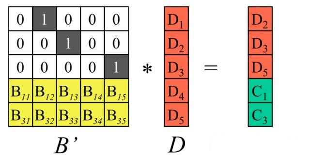

求出B'的逆矩阵并在等式两边左乘上它，即可恢复所有的源数据块D。

##### 编码方式
###### 横式编码(horizontalcodes)
这种编码方式下，code数据块单独uoweie数据块，而不是和data块放在一起。例如EVENODD编码，RDP编码都是横式编码。
###### 纵式编码（verticalcodes）
code存储在数据所在的磁盘，某些块既有数据又有code。如X-code编码。
##### 几种常用的矩阵
###### 范德蒙矩阵
编码复杂度为O（mn），其中m为校验数据个数，n为输入数据个数。解码复杂度为O（n^3），解码具有较高的计算复杂度，会影响IO的性能，增加IO延迟。  
我们可以构建对数/反对数表将乘法运算转换成加法运算，并且在迦罗华域中，加法运算转换成了XOR运算。

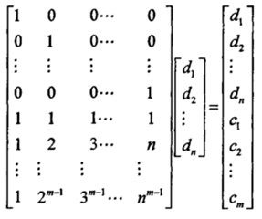

###### 基于柯西矩阵的编解码
Xi和Yi都是迦罗华域GF（2^w）中的元素。柯西矩阵任意一个子方阵都存在逆矩阵，解码复杂度为O（n^2）。
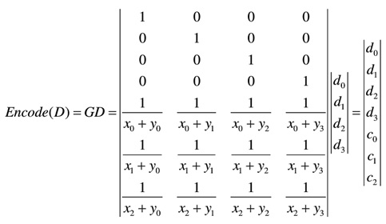

##### 柯西编解码过程优化
从编解码过程来看，柯西编解码最大的运算量是乘法和加法运算。   
从数学的角度来看，在迦罗华有限域中，任何一个GF（2^w）域上的元素都可以映射到GF（2）二进制域，并且采用一个二进制矩阵的方式表示GF（2^w）中的元素。例如，GF（2^3）域中的元素可以表示成GF（2）域中的二进制矩阵：

 
柯西编解码为了降低乘法复杂度，采用了有限域上的元素都可以使用二进制矩阵表示的原理，将乘法运算转换成了迦罗华域“与运算”和“XOR逻辑运算”，提高了编解码效率。柯西编码的运算复杂度为O（n(n- m)），解码复杂度为O（n^2）。
## 立项依据

### Ceph纠删码数据存储
在erasure coded pool中，每个数据对象都被存放在K+M块中。对象被分成K个数据库和M个编码块；erasure coded pool的大小被定义成K+M块，每个块存储在一个OSD中；块的顺序号作为　　object的属性保存在对象中。　

例如:

创建5个OSDs (K=3 M=2)的erasure coded pool，允许损坏2个(M = 2)；
对象 NYAN 内容是 ABCDEFGHI ；NYAN写入pool时，纠删码函数把NYAN分3个数据块：第1个是ABC,第2个是DEF，第3个是GHI；如果NYAN的长度不是K的倍数，NYAN会被填充一些内容；
纠删码函数也创建2个编码块：第4个是YXY，第5个是GQC；　

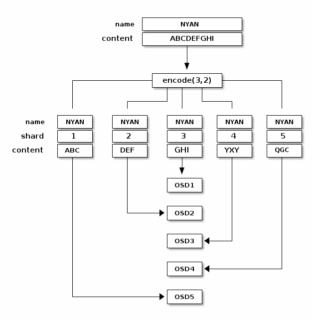

每个块都被存储在osd中；对象中的块有相同的名字 (NYAN)但存储在不通的osd中。除了名字外，这些块都有一个序号，需要保存在对象属性中 (shard_t)
比如，块1包含ABC保存在OSD5中；块4包含YXY保存在OSD3中。
当从erasure coded pool中读取对象NYAN时，纠删码函数读取3个块：块1(ABC)/块3(GHI)/块4(YXY)；然后重建原始对象内容ABCDEFGHI；
纠删码函数被告知：块2和块5丢失；块5不能读取是因为OSD4损坏了；块3不能读取，是因为OSD2太慢了。

###  Ceph纠删码库
Ceph的默认纠删码库是Jerasure，即Jerasure库；
当管理员创建一个erasure-coded后端时，可以指定数据块和代码块参数。
Jerasure库是第三方提供的中间件。Ceph环境安装时，已经默认安装了Jerasure库。

### 间断全写
在erasure coded pool中,主OSD负责所有的写操作；它负责K+M块的编码，并写到其他OSD中。它还负责维护一个权威的pg log版本。
下图中，一个erasure coded是K=2/M=1,3个OSD节点，2个是K的节点，1个是M的节点；pg分别在OSD1/OSD2/OSD3中；
一个对象被编码保存在这些OSD中：
块D1v1(数据块1,版本1)在OSD1中；
块D2v1(数据块2,版本1)在OSD2中；
块C1v1(编码块1,版本1)在OSD3中；
在每个OSD中的PG log是一致的(1,1 是epoch 1, version 1)；

OSD 1是主要的，从客户机接收一个写满，这意味着有效负载将完全替换对象，而不是覆盖对象的一部分。创建对象的版本2（v2）以覆盖版本1（v1）。OSD 1将有效负载编码为三个块：D1v2（即数据块1版本2）将在OSD 1上，D2v2将在OSD 2上，C1v2（即编码块1版本2）将在OSD 3上。每个块被发送到目标OSD，包括主OSD，它除了处理写操作和维护放置组日志的权威版本外，还负责存储块。当OSD接收到指示它写入块的消息时，它还会在放置组日志中创建一个新条目来反映更改。例如，一旦OSD3存储了c1v2，它就会将条目1,2（即epoch 1，版本2）添加到日志中。因为OSD是异步工作的，所以一些块可能还在运行（例如d2v2），而其他块则被确认并在磁盘上（例如c1v1和d1v1）。 

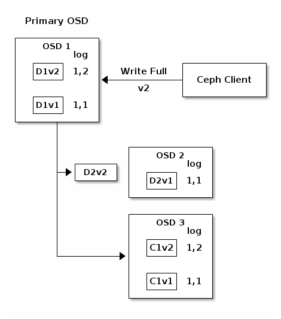

如果一切正常，则在代理集中的每个OSD上确认块，日志的最后一个完整指针可以从1,1移动到1,2。 

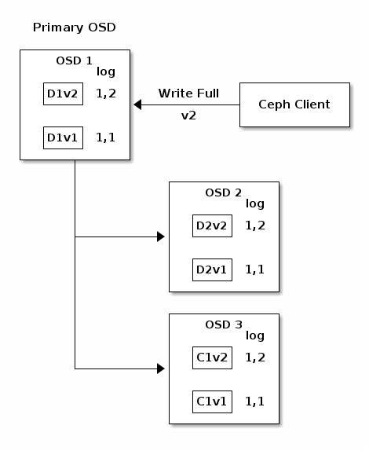

最后，保存以前版本块的文件将会被删除： D1v1 on OSD1, D2v1on OSD2 and C1v1 on OSD3。

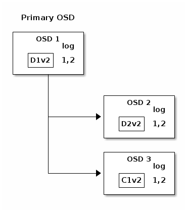

但是意外有时也会发生。如果OSD1损坏了，而D2v2还在写入，则object的version 2 就是局部写入: OSD3有一个块但是不够恢复其他块。丢失了2个块： D1v2 和D2v2，可是the erasure coding参数是K=2/M=1,要求至少2个块可用才能重建第3个块。 这时，OSD4成为主节点，并发现last_complete log记录是1,1 ，这将是新权威的记录头。

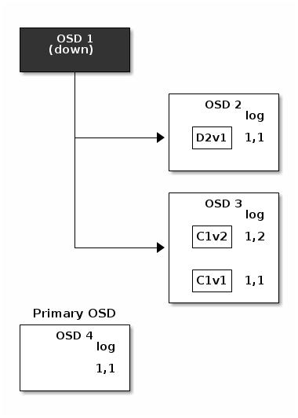

节点OSD3中的Log记录1,2和节点OSD4中新的权威log记录不一致：OSD3中的Log被丢弃，C1v2块被删除。D1v1块被重建（在scrubbing时使用纠删码函数重建）并保存到新的主节点OSD4中。

### 使用范围
#### 冷数据
1. 主要存储1G以上的对象，比如镜像、映像等，这些数据10%都是每月读取一次；
2. 新对象每天添加，但是这些对象添加后不修改；
3. 这些数据，平均读1万次，写一次。
4. 创建一个replicated pool作为erasure coded pool的ceche分层；当一个对象一周没有访问时，可以把该对象降级(把该对象从replicated pool移动到erasure-coded pool中)；当然也可以相反的调整；
5. erasure-coded pool为冷数据设计，适合慢的硬件设备，访问比较少的数据；replicated pool为快速设备和快速访问设计的。

#### 廉价多数据中心存储
十个专用网络链接的数据中心，每个数据中心包含相同大小的存储空间，但没有电源备份和无空气冷却系统。
创建这样一个erasure-coded pool，同时允许3个节点损坏而数据不丢失；数据块为6(K=6),而编码块为3(M=3)；其开销是50%
而创建同样的复制池，其开销为400%(4个副本);

### Ceph基于冷热数据分层的容错机制
存储中数据可根据访问热度分为三种:热数据、温数据和冷数据。热数据通常需要在高性能、高可用性、高要求的环境下即时存取。温数据处于近线或在线备份环境中，用户需要快速访问这些数据，但访问的次数较少。冷数据通常访问次数极少，通常用于归档备份。针对云存储中数据访问热度不同，提出一种基于数据热度分层的容错机制。

所有数据先按照副本策略存储，本机制对存入系统的数据，实时统计该数据的被访问频率，设定热数据、温数据、冷数据阈值，高于热数据阈值的判断为热数据，低于冷数据阈值则判定为冷数据，在冷热数据阈值之间的判定为温数据。每3个月进行一次数据热度划分，数据被访问频率高于热数据阈值时，判断为热数据，存放在副本池里，该存储池采用副本容错机制。数据访问频率低于冷数据阈值时，判定为冷数据，存放在范德蒙RS纠删码池里，该存储池采用范德蒙RS纠删码容错机制。对于温数据，存放在柯西纠删码池里，该存储池采用改进的柯西RS纠删码容错机制。

### SIMD
#### 简介
Single instruction, multiple data （SIMD）是弗林分类法中的一类并行计算机。它描述具有多个处理元素的计算机，这些处理元素同时在多个数据点上执行相同的操作。这样的机器利用数据级的并行性，而不是并发性：有同时（并行）计算，但在给定的时刻只有一个进程（指令）。SIMD特别适用于诸如调整数字图像对比度或调整数字音频音量等常见任务。大多数现代的CPU设计包括SIMD指令，以提高多媒体使用的性能。不要将SIMD与使用线程的SIMT混淆。 
#### 优势
可以利用SIMD的应用程序是在大量数据点上增加（或减去）相同的值的应用程序，这是许多多媒体应用程序中的常见操作。一个例子是改变图像的亮度。图像的每个像素由颜色的红色（R）、绿色（G）和蓝色（B）部分的亮度的三个值组成。为了改变亮度，从存储器中读取r、g和b值，向它们添加一个值（或从中减去一个值），然后将得到的值写回存储器。              

对于SIMD处理器，此过程有两个改进。对于其中一个，数据被理解为以块为单位，并且可以同时加载多个值。一个SIMD处理器将没有一系列的指令说“检索这个像素，现在检索下一个像素”，而是有一条指令说“检索n个像素”（其中n是一个从设计到设计都不同的数字）。由于各种原因，这可能比单独检索每个像素花费的时间要短得多，就像传统的CPU设计一样。              

另一个优点是指令在一个操作中对所有加载的数据进行操作。换言之，如果SIMD系统同时加载8个数据点，则应用于数据的添加操作将同时发生在所有8个值上。这种并行性与超标量处理器提供的并行性是分开的；即使在非超标量处理器上，八个值也是并行处理的，并且超标量处理器可以并行执行多个SIMD操作。 

### 纠删码的演化，RS->LRC
纠删码通过技术含量较高的算法，提供和副本近似的可靠性，同时减小了额外所需冗余设备的数量，从而提高了存储设备的利用率。但纠删码所带来的额外负担主要是计算量和数倍的网络负载，优缺点都相当明显。尤其是在出现硬盘故障后，重建数据非常耗CPU，而且计算一个数据块需要通过网络读出N倍的数据并传输，所以网络负载也有数倍甚至10数倍的增加
。
整体来看，若采用纠删码技术，你能够得到了希望的容错能力和存储资源利用率，但是需要接受一定的数据重建代价，两者间做一个平衡。
 
难道事情就这个样子了吗？有没有优化改善的空间呢？答案是“有”。
如果仔细分析故障出现的情况，你将很容易发现两个特征：
特征一：所有的故障都将导致同样的重建代价，无论是一个盘，还是M个盘
特征二：单个磁盘故障的几率远远大于多个磁盘同时故障的几率，通常在90%以上
 
因此，优化的思路自然聚集到更容易出现的单个磁盘故障上来，如何更有效的处理这种概率较大的事件呢，直接出现的对策就是分组，把单个磁盘故障影响范围缩小到各个组内部，出坏盘故障时，该组内部解决，在恢复过程中读组内更少的盘，跑更少的网络流量，从而减小对全局的影响。
 
LRC（Locally Repairable Codes），我理解为局部校验编码，其核心思想为：将校验块（parity block）分为全局校验块(global parity)、局部校验块(local reconstruction parity)，故障恢复时分组计算。

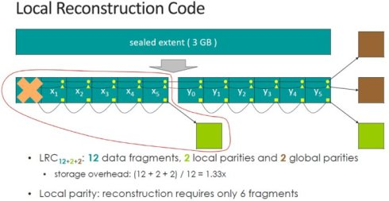

以微软Azure的云存储（Windows Azure Storage）实现为例，它采用LRC（12,2,2）编码，将12个数据块为一组编码，并进一步将这12个数据块平均分为2个本地组， 每个本地组包括6个数据块，并分别计算出一个局部校验块，之后把所有12个数据块计算出2个全局校验块。

当发生任何一个数据块错误时，只需用本地组内的数据和校验块用于计算，即可恢复出原始数据。而恢复代价（通过网络传输的数据块数量）就由传统RS（12,4）编码的12，变为6，恢复过程的网络I/O开销减半，同时空间冗余率保持不变，仍为（12+2+2）/12 = 1.33
 
微软在介绍中有过一张图来对RS和LRC进行对比,这里借用一下

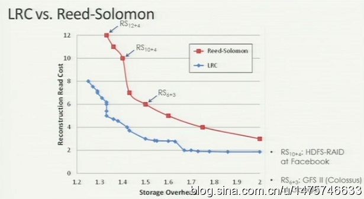

图中，蓝色是LRC，红色是RS，可以很清楚的看到，使用LRC的编码方式后，虽然空间利用率（横轴）并没有提高，但是重建代价（纵轴）却有明显的改善。考虑到分布式系统里故障是一个常态，重建代价的降低和局部化就是非常有价值的一个技术改进了。
 
另外，有一点要特别注意，LRC并不是100%不丢数据的，4个块坏掉的情况下，只有86%的几率能找回数据，从可靠性排序来说，RS12+4 》 LRC12+2+2 》RS6+3。
 
但综合来说，LRC还是很有竞争力的技术，目前，Microsoft、Google、Facebook、Amazon、淘宝（TFS）都已经在自己的产品中采用了Erasure Code，并且大多都从经典RS转向LRC。虽然具体实现，但基本原理都是LRC的组内校验+全局校验。
### 三种的备份方式
#### 完全备份
完全备份需要备份文件中的所有内容，并不依赖文件的存档属性来确定备份哪些文件。
#### 差异备份
差异备份只备份那些自从上一次**完全备份**之后变更的数据。  
差异备份相比于完全备份需要备份的数据更少、速度更快，但是差异备份的数据量也会随着差异备份的次数而增加，直到进行下一次完全备份。

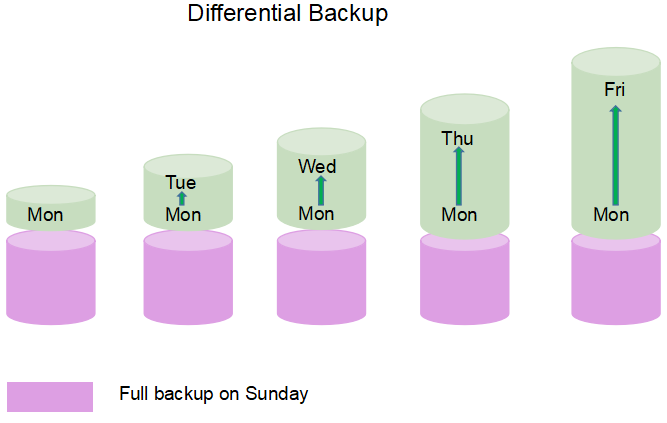

#### 增量备份
增量备份也是只备份修改的数据，但是这些数据是相对于上一次**备份**（可以是完全备份、也可以是增量备份）而言的。

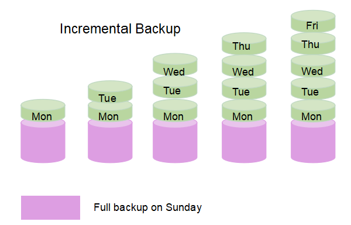

#### 三种备份方式的比较
| Backup Strategy          | Backup Basis |   Backup Speed    |     Space Taken|  Media Required for Recovery |  
| -------- | --------------- | ------------------------- | ---------|---------|   

| Full Backup | Full Backup          | Slow | Big | Most recent backup only |
| Differential Backup  | Full Backup    | Medium  | Big |Most recent full + most recent differential |
| Incremental Backup	  | Last Backup of Any Type | Fast  | Small | ost recent full + all incremental since full |

## 前瞻性及重要性
### 纠删码的重要性
数据的爆炸式增长使得存储系统的规模不断增加，存储设备的可靠性却一直没有得到显著提高（SSD 从SLC 到MLC 和TLC 可靠性不断下降，磁盘随着单位面积写入数据更多导致可靠性无法提升），从而给数据的持久化存储带来巨大挑战。另外随着存储系统规模的增大，存储系统中的冷数据的增加将远超过热数据的增加，如何安全保存冷数据，在需要的时候能够获取冷数据也成为存储系统中的重要挑战。而纠删码对上述的问题都有较好的解决，因此在当下提及并改进纠删码的技术是有很强的实际意义的。
### ceph现阶段纠删码的缺点
纠删码提高了存储容量，却降低了速度。这也是纠删码使用时的问题和我们打算做这个方面内容的原因。我们使用的方法是   
在分块数量固定、每块512字节的存储格式上，使用柯西编解码方式，利用SIMD指令集加速数据的计算，实现类APFS以增量方式修改和写数据的功能，最后在有条件的情况下考虑文件的分布存储位置优化问题，通过冷热数据分层为其分配不同比例的数据块和校验块，实现更好的容错机制，从而达到对可用性的要求。    
相关的内容也已经在上面已经都有所介绍和涉及，所以在这里也不再过多赘述。我们做这个的目的无疑是在ceph现有的成熟生态上的可行改进。
## 相关工作
### Google和FACEBOOK的纠删码实现
#### FACEBOOK
Facebook早期在HDFS RAID中采用的编码方式RS(10,4)

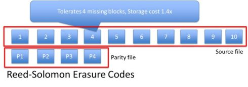

如上图所示。将每个待编码的数据均分为10个数据块, 后面添加4个校验的parity校验块。这种RS编码方式的空间冗余率为（10+4）/10 = 1.4x,发生任何一个数据块错误的恢复代价为10，即发生任意一个块错误需要10次I/O操作，从网络传输的数据量为10个数据块。
 
同样为减少数据恢复的网络I/O代价, FaceBook在13年和加州大学共同发表了论文， [XORing Elephants: Novel Erasure Code for Big Data](http://anrg.usc.edu/~maheswaran/Xorbas.pdf)，并把这一成果用在“进阶版HDFS”上

其LRC编码方法如下：
除了在原先的10个数据块之后添加4个校验块外，还将10个数据块均分为2组，每组单独计算出一个局部校验块（Parity），将数据恢复代价由原来的10降低为5.即恢复任何一个数据块错误只需要进行5次网络I/O，从网络传输5个数据块。此种编码方式的空间冗余率 为（10+4+2）/10 = 1.6

#### Google
Google在04年发布GFS的经典论文后，09年开始开发第二代GFS（Colossus），它采用了最基本的RS（6,3）编码，将一个待编码数据单元(Data Unit)分为6个数据块, 再添加3个parity block，最多可容包括parity blocks在内的任意3个数据块错误。

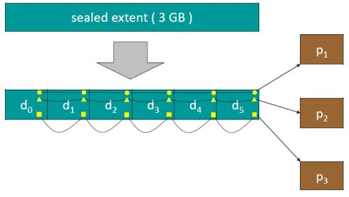

数据恢复的网络I/O开销为：恢复任何一个数据块需要6次I/O，通过网络传输6个数据block，存储的空间冗余率 为（6+3)/6 = 1.5

#### 对比表

|     | Storage Sysyems          | Reed-Solomon codes |                
| -------- | --------------- | ------------------------- |   
| Linux | Linux RAID-6            | RS(10,8)|   
| Google   | Google File System  II              | RS(9,6)                        | 
| Quantcast  | Quantcast File System              | RS(9,6)                        | 
| hadoop | Intel & Cloudera' HDFS-EC              | RS(9,6)                       | 
| Yahoo | Yahoo Cloud Object Store              | RS(11,8)                       | 
| Backblaze | Blackblaze's online backup              | RS(20,17)                        |
| Facebook | Facebook's f4 BOLB storage system| RS(14,10) |
| Baidu | Baidu's Atlas Cloud Storage | RS(12,8)  |

### 增量写的实现
#### 简介
利用新数据相对于旧数据的增量来更新校验块，相比于重新编码，这种方法减少了更新过程中涉及到的网络IO、硬盘IO、计算开销。
#### APFS
APFS，允许多个文件系统共享相同的存储区块，在无需重新分配的情况下为盘符更改容量尺寸。另外一个空间节省技术就是全新的克隆系统，只允许写入权限克隆文件到新的路径。

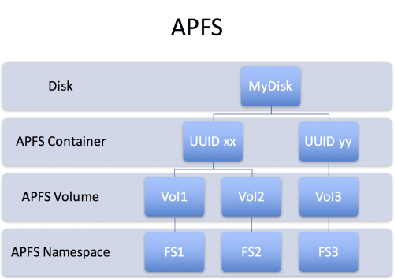

#### 方法
利用纠删码的线性性，首先读取需要更新的原始数据块，然后计算原始块和新块的差值，并应用到校验码，最后将要更新的新数据块和校验块写入对应的位置。
## 参考文献

[Ceph官方文档](http://docs.ceph.com/docs/master/architecture/#erasure-coding)

[使用SIMD技术提高C++程序性能](https://www.jianshu.com/p/8de235df3290)

[Erasure Coding（纠删码）深入分析](https://blog.csdn.net/qq_14821541/article/details/51690479)

[分布式系统下的纠删码技术（一） -- Erasure Code (EC)](https://blog.csdn.net/u011026968/article/details/52295666)
