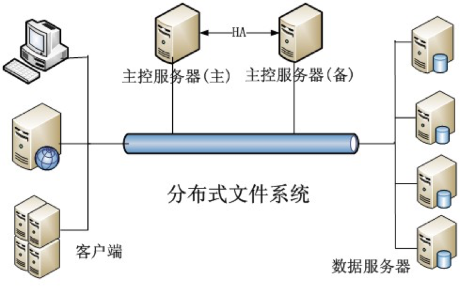
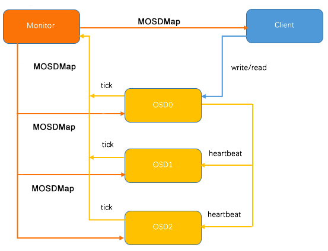
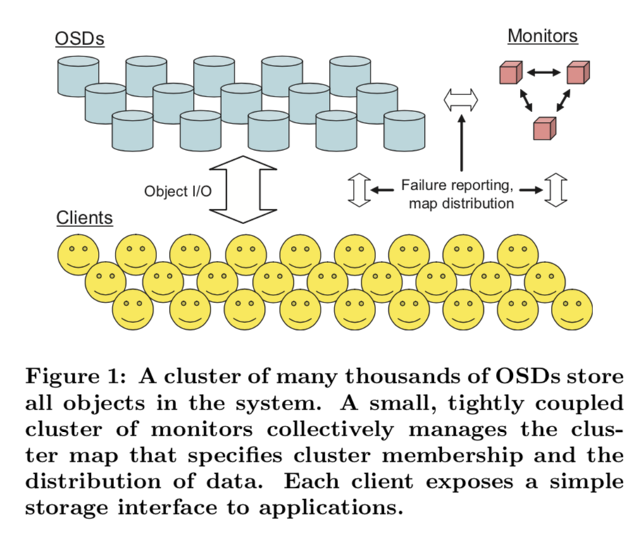
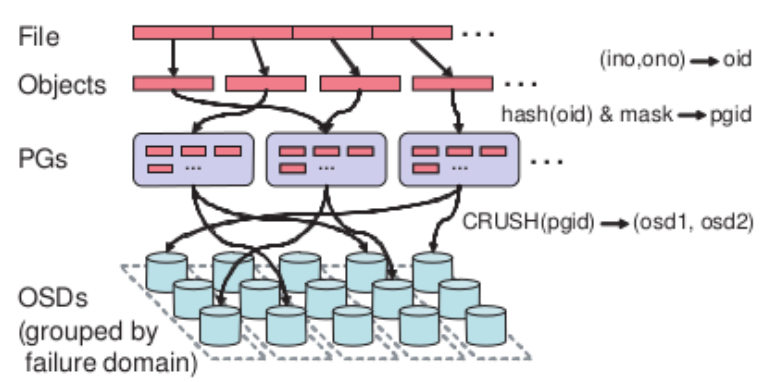
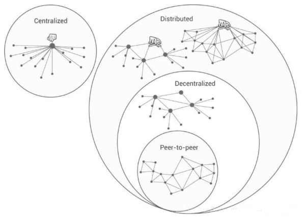
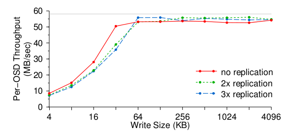
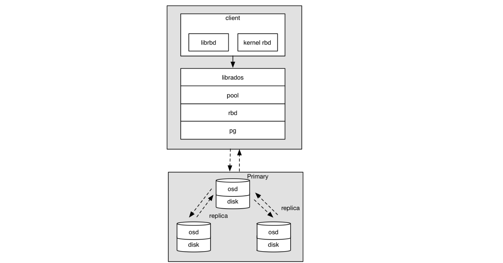

---

# 1. 调研报告


- [1. 调研报告](#1-调研报告)
    - [1.1. 项目成员](#11-项目成员)
    - [1.2. 项目简介](#12-项目简介)
    - [1.3. 项目背景](#13-项目背景)
        - [1.3.1. 分布式系统背景](#131-分布式系统背景)
            - [1.3.1.1. 集中式系统](#1311-集中式系统)
            - [1.3.1.2. 分布式系统](#1312-分布式系统)
        - [1.3.2. 分布式存储系统简介](#132-分布式存储系统简介)
        - [1.3.3. 分布式存储系统类型分类](#133-分布式存储系统类型分类)
            - [1.3.3.1. 两种主流的存储类型：块存储和文件存储](#1331-两种主流的存储类型块存储和文件存储)
            - [1.3.3.2. 一种新的网络存储架构：对象存储](#1332-一种新的网络存储架构对象存储)
        - [1.3.4. 分布式存储系统典型架构](#134-分布式存储系统典型架构)
        - [1.3.5. 分布式存储系统算法](#135-分布式存储系统算法)
            - [1.3.5.1. Hash](#1351-hash)
            - [1.3.5.2. 一致性Hash](#1352-一致性hash)
            - [1.3.5.3. 带负载上限的一致性Hash](#1353-带负载上限的一致性hash)
            - [1.3.5.4. 带虚拟节点的一致性Hash](#1354-带虚拟节点的一致性hash)
            - [1.3.5.5. 分片](#1355-分片)
            - [1.3.5.6. CRUSH算法](#1356-crush算法)
        - [1.3.6. 一种分布式存储系统：Ceph](#136-一种分布式存储系统ceph)
        - [1.3.7. Ceph核心组件及概念介绍](#137-ceph核心组件及概念介绍)
            - [1.3.7.1. Monitor](#1371-monitor)
            - [1.3.7.2. OSD](#1372-osd)
            - [1.3.7.3. MDS](#1373-mds)
            - [1.3.7.4. Object](#1374-object)
            - [1.3.7.5. PG](#1375-pg)
            - [1.3.7.6. OSDMap](#1376-osdmap)
            - [1.3.7.7. RADOS](#1377-rados)
            - [1.3.7.8. Libradio](#1378-libradio)
            - [1.3.7.9. CRUSH](#1379-crush)
            - [1.3.7.10. RBD](#13710-rbd)
            - [1.3.7.11. RGW](#13711-rgw)
            - [1.3.7.12. CephFS](#13712-cephfs)
        - [1.3.8. 数据库](#138-数据库)
    - [1.4. 立项依据](#14-立项依据)
        - [1.4.1. Ceph的优点：高性能、高可扩展性、高可用性、特性丰富](#141-ceph的优点高性能高可扩展性高可用性特性丰富)
            - [1.4.1.1. CRUSH算法](#1411-crush算法)
            - [1.4.1.2. 容灾域的隔离](#1412-容灾域的隔离)
            - [1.4.1.3. 支持三种存储](#1413-支持三种存储)
                - [1.4.1.3.1. 块存储](#14131-块存储)
                - [1.4.1.3.2. 文件存储](#14132-文件存储)
                - [1.4.1.3.3. 对象存储](#14133-对象存储)
            - [1.4.1.4. 统一存储架构](#1414-统一存储架构)
            - [1.4.1.5. 去中心化](#1415-去中心化)
        - [1.4.2. Ceph IO算法流程](#142-ceph-io算法流程)
            - [1.4.2.1. 伪代码流程](#1421-伪代码流程)
        - [1.4.3. Ceph RBD IO流程](#143-ceph-rbd-io流程)
        - [1.4.4. Ceph RBD IO框架图](#144-ceph-rbd-io框架图)
            - [1.4.4.1. 客户端写数据osd过程](#1441-客户端写数据osd过程)
        - [1.4.5. Ceph Pool和PG分布情况](#145-ceph-pool和pg分布情况)
            - [1.4.5.1. 说明](#1451-说明)
            - [1.4.5.2. 现状](#1452-现状)
            - [1.4.5.3. 扩容后](#1453-扩容后)
            - [1.4.5.4. 说明](#1454-说明)
        - [1.4.6. Ceph的使用](#146-ceph的使用)
            - [1.4.6.1. 预备条件](#1461-预备条件)
            - [1.4.6.2. 搭建Ceph](#1462-搭建ceph)
            - [1.4.6.3. 构建一个源tarball](#1463-构建一个源tarball)
            - [1.4.6.4. 运行测试群集](#1464-运行测试群集)
            - [1.4.6.5. 运行测试单元](#1465-运行测试单元)
        - [1.4.7. 建立文档](#147-建立文档)
            - [1.4.7.1. 先决条件](#1471-先决条件)
            - [1.4.7.2. 建立文档](#1472-建立文档)
    - [1.5. 前瞻性及重要性](#15-前瞻性及重要性)
        - [1.5.1. Ceph社区的贡献者](#151-ceph社区的贡献者)
        - [1.5.2. Ceph存储引擎](#152-ceph存储引擎)
        - [1.5.3. Ceph与Openstack](#153-ceph与openstack)
    - [1.6. 相关工作](#16-相关工作)
        - [1.6.1. 纠删码](#161-纠删码)
            - [1.6.1.1. 纠删码相比副本](#1611-纠删码相比副本)
            - [1.6.1.2. 与CRUSH的关系](#1612-与crush的关系)
            - [1.6.1.3. 各公司的纠删码编码技术](#1613-各公司的纠删码编码技术)
                - [1.6.1.3.1. Google纠删码](#16131-google纠删码)
                - [1.6.1.3.2. Microsoft纠删码](#16132-microsoft纠删码)
                - [1.6.1.3.3. Facebook纠删码](#16133-facebook纠删码)
        - [1.6.2. 数据库](#162-数据库)
            - [1.6.2.1. 数据库简介](#1621-数据库简介)
            - [1.6.2.2. 分布式数据库](#1622-分布式数据库)
            - [1.6.2.3. 分布式数据库的优点](#1623-分布式数据库的优点)
    - [1.7. 参考文献](#17-参考文献)


## 1.1. 项目成员

张灏文

陈云开

毕超

刘硕

张铭哲


## 1.2. 项目简介
现有的数据库一般没有直接使用对象存储，至于底层采用块和文件的数据库均有实现，而数据库本身需要实现快速修改，快速访问的特性，底层使用哪种方式的性能并不能说一定前者与后者有明显区别。而Ceph本身是一个以对象存储为底层的架构，我们打算在这个已有的非常成熟的分布式系统上建立一个对数据库的实现，对其性能进行探究，并对此优化。

## 1.3. 项目背景

### 1.3.1. 分布式系统背景
#### 1.3.1.1. 集中式系统
集中式系统有一个大型的中央处理系统，中央处理系统是一台高性能、可扩充的计算机，所有的数据、运算、处理任务全部在中央计算机系统上完成。  
集中式系统具有明显的优点，开发测试运维会比较方便，不用考虑复杂的分布式环境。  
随着需求的变化，集中式系统的弊端日趋明显，不易扩展，更新都必须更新所有的应用，一个有问题会导致所有的应用都有问题。当系统越来越大，集中式将是系统最大的瓶颈。    
#### 1.3.1.2. 分布式系统
分布式系统是若干独立计算机的集合，这计算机对用户来说就像单个相关系统。也就是说在一个分布式系统中，一组独立的计算机展现给用户的是一个统一的整体，用户感知不到背后的逻辑，就像访问单个计算机一样。  
在分布式系统中，应用可以按业务类型拆分成多个应用，再按结构分成接口层、服务层。我们也可以按访问入口分，如移动端、PC端等定义不同的接口应用。数据库也可以按业务类型拆分成多个实例，还可以对单表进行分库分表，增加分布式缓存、搜索、文件、消息队列、非关系型数据库等中间件……  
分布式系统可以解决集中式不便扩展的弊端，我们可以很方便的在任何一个环节扩展应用，即使一个应用出现问题也不会影响到别的应用。 

### 1.3.2. 分布式存储系统简介
分布式存储系统，是将数据分散存储在多台独立的设备上。  
与分布式系统的基本构思一致，对于传统的网络存储系统存在的问题：存储服务器成为系统性能的瓶颈，可靠性和安全性不能满足，无法应对大规模存储应用……分布式网络存储系统采用可扩展的系统结构，使用多台存储服务器分担存储负荷，位置服务器定位存储信息，提高了系统的可靠性、可用性和存取效率，且易于扩展。 
 
### 1.3.3. 分布式存储系统类型分类
#### 1.3.3.1. 两种主流的存储类型：块存储和文件存储  
块级是指以扇区为基础，一个连续的扇区组成一个块，也叫物理块，是在文件系统与块设备（例如：磁盘驱动器）之间。  
文件级是指文件系统，单个文件可能由一个或多个逻辑块组成，且逻辑块之间是不连续分布。  
映射关系：扇区→物理块→逻辑块→文件系统
#### 1.3.3.2. 一种新的网络存储架构：对象存储  
对象是系统中数据存储的基本单位，一个对象实际上就是文件的数据和一组属性信息的组合，这些属性信息可以定义基于文件的RAID参数、数据分布和服务质量等，而传统的存储系统中用文件或块作为基本的存储单位，在块存储系统中还需要始终追踪系统中每个块的属性，对象通过与存储系统通信维护自己的属性。在存储设备中，所有对象都有一个对象标识，通过对象标识OSD命令访问该对象。通常有多种类型的对象，存储设备上的根对象标识存储设备和该设备的各种属性，组对象是存储设备上共享资源管理策略的对象集合等。

### 1.3.4. 分布式存储系统典型架构


目前比较主流的一种分布式文件系统架构，如下图所示，通常包括主控服务器（或称元数据服务器、名字服务器等，通常会配置备用主控服务器以便在故障时接管服务），多个数据服务器（或称存储服务器，存储节点等），以及多个客户端，客户端可以是各种应用服务器，也可以是终端用户。



分布式文件系统的数据存储解决方案，归根结底是将大问题划分为小问题。大量的文件，均匀分布到多个数据服务器上后，每个数据服务器存储的文件数量就少了。  
那么通过使用大文件存储多个小文件的方式，总能把单个数据服务器上存储的文件数降到单机能解决的规模，将大文件划分成多个相对较小的片段，存储在多个数据服务器上。


### 1.3.5. 分布式存储系统算法
#### 1.3.5.1. Hash
一个简单直观的想法是直接用 Hash 来计算，简单的以 Key 做哈希后对节点数取模。可以看出，在 key 足够分散的情况下，具有一定的均匀性，但有节点加入或退出时，所有的原有节点都会受到影响。稳定性存在问题，无法得到需求的满足。

#### 1.3.5.2. 一致性Hash
一致性 Hash 可以很好的解决稳定性问题，可以将所有的存储节点排列在收尾相接的 Hash 环上，每个 key 在计算 Hash 后会顺时针找到先遇到的存储节点存放。而当有节点加入或退出时，仅影响该节点在 Hash 环上顺时针相邻的后续节点。但使用该算法时，均匀性存在问题，即使可以将存储节点等距排列，也会在存储节点个数变化时带来数据的不均匀。


#### 1.3.5.3. 带负载上限的一致性Hash
一致性 Hash 有节点变化时不均匀的问题。Google 在 2017 年提出了 Consistent Hashing with Bounded Loads 来控制这种不均匀的程度。该算法给 Hash 环上的每个节点一个负载上限 为 1 + e 倍的平均负载，这个e可以自定义。当 key 在 Hash 环上顺时针找到合适的节点后，会判断这个节点的负载是否已经到达上限，如果已达上限，则需要继续找之后的节点进行分配。


#### 1.3.5.4. 带虚拟节点的一致性Hash
为了解决负载不均匀和异构的问题，可以在一致性 Hash 的基础上引入虚拟节点。实际的存储节点根据其不同的权重，对应一个或多个虚拟节点，所有落到相应虚拟节点上的 key 都由该存储节点负责。

#### 1.3.5.5. 分片
分片将 Hash 环切割为相同大小的分片，然后将这些分片交给不同的节点负责。一个节点退出时，其所负责的分片 并不需要顺时针合并给之后节点，而是可以更灵活的将整个分片作为一个整体交给任意节点。那么在实际应用中，一个分片往往可以作为最小的数据迁移和备份单位。


#### 1.3.5.6. CRUSH算法
CRUSH 算法本质上也是一种基于分片的数据分布方式，其试图在以下几个方面进行优化：  
-  分片映射信息量：避免中心目录服务和存储节点及客户端之间交互大量的分片映射信息，而改由存储节点或客户端自己根据 少量且稳定的集群节点拓扑和确定的规则自己计算分片映射。  
-  完善的故障域划分：支持层级的故障域控制将同一分片的不同副本按照配置划分到不同层级的故障域中。客户端 或存储节点利用 key 、存储节点的拓扑结构和分配算法，独立的进行分片位置的计算，得到一组负责对应分片及副本的存储位置。
 
### 1.3.6. 一种分布式存储系统：Ceph
Ceph起源于Sage Well在UCSC就读博士期间，它是一种针对性能、可靠性和可扩展性而设计的分布式存储系统，并为对象存储、块存储和文件存储提供接口。Ceph的主要目标完全分布式操作，消除单点故障（Single Point of Failure），同时可扩展到EB（1EB=1048576TB）级别。


### 1.3.7. Ceph核心组件及概念介绍
#### 1.3.7.1. Monitor

一个Ceph集群需要多个Monitor组成的小集群，它们通过Paxos同步数据，用来保存OSD的元数据。

Monitor的主要任务就是维护集群视图的一致性，在维护一致性的时候使用了Paxos协议，并将其实例化到数据库中，方便后续的访问。所以Monitor基本上是由三类结构支撑起来的，第一类是管理各种map和相关内容的PaxosService实例，第二类是Paxos实例，第三类是对k/v store的封装，即MonitorDBStore实例。

#### 1.3.7.2. OSD
OSD全称Object-based Storage Device，也就是负责响应客户端请求返回具体数据的进程。一个Ceph集群一般都有很多个OSD。  
在启动时对 OSDMap 进行变更的情况，当一个新的 OSD 启动时，这时 Monitor 所掌握的最新 OSDMap 并没有该 OSD 的情况，因此该 OSD 会向 Monitor 申请加入，Monitor 再验证其信息后会将其加入 OSDMap 并标记为IN，并且将其放在 Pending Proposal 中会在下一次 Monitor “讨论”中提出，OSD 在得到 Monitor 的回复信息后发现自己仍然没在 OSDMap 中会继续尝试申请加入，接下来 Monitor 会发起一个 Proposal ，申请将这个 OSD 加入 OSDMap 并且标记为 UP 。然后按照 Paxos 的流程，从 proposal->accept->commit 到最后达成一致，OSD 最后成功加入 OSDMap 。当新的 OSD 获得最新 OSDMap 发现它已经在其中时。这时，OSD 才真正开始建立与其他OSD的连接，Monitor 接下来会开始给他分配PG。

#### 1.3.7.3. MDS
MDS全称Ceph Metadata Server，是CephFS服务依赖的元数据服务。  
Ceph MDS是元数据服务器，只有Ceph文件系统（CephFS）才需要，其他存储方法不需要，如基于对象的存储不需要MDS服务。Ceph MDS作为一个守护进程运行，它允许客户端挂载一个任意大小的POSIX文件系统。MDS不直接向客户端提供任何数据，数据通过OSD服务提供。MDS提供一个带智能缓存层的共享型连续文件系统，因此可以大大减少读写操作。MDS在动态子树分区和一个MDS只负责一部分元数据等方面进一步发挥了它的好处。它在本质上就是动态的，守护进程可以加入、离开，并且快速接管出错的节点。

#### 1.3.7.4. Object
Ceph最底层的存储单元是Object对象，每个Object包含元数据和原始数据。

#### 1.3.7.5. PG
PG全称Placement Grouops，是一个逻辑的概念，一个PG包含多个OSD。引入PG这一层其实是为了更好的分配数据和定位数据，通过将某些东西进行逻辑归组，从而达到统一管理，提升效率的作用。  
PG(Placement Group)是 Ceph 中非常重要的概念，它可以看成是一致性哈希中的虚拟节点，维护了一部分数据并且是数据迁移和改变的最小单位。它在 Ceph 中承担着非常重要的角色，在一个 Pool 中存在一定数量的 PG (可动态增减)，这些 PG 会被分布在多个 OSD ，分布规则可以通过 CRUSH RULE 来定义。Monitor 维护了每个Pool中的所有 PG 信息，比如当副本数是三时，这个 PG 会分布在3个 OSD 中，其中有一个 OSD 角色会是 Primary ，另外两个 OSD 的角色会是 Replicated。Primary PG负责该 PG 的对象写操作，读操作可以从 Replicated PG获得。而 OSD 则只是 PG 的载体，每个 OSD 都会有一部分 PG 角色是 Primary，另一部分是 Replicated，当 OSD 发生故障时(意外 crash 或者存储设备损坏)，Monitor 会将该 OSD 上的所有角色为 Primary 的 PG 的 Replicated 角色的 OSD 提升为 Primary PG，这个 OSD 所有的 PG 都会处于 Degraded 状态。然后等待管理员的下一步决策，所有的 Replicated 如果原来的 OSD 无法启动， OSD 会被踢出集群，这些 PG 会被 Monitor 根据 OSD 的情况分配到新的 OSD 上。

#### 1.3.7.6. OSDMap
OSDMap 是 Ceph 集群中所有 OSD 的信息，所有 OSD节点的改变如进程退出，节点的加入和退出或者节点权重的变化都会反映到这张 Map 上。  
这张 Map 不仅会被 Monitor 掌握，OSD 节点和 Client 也会从 Monitor 得到这张表，因此实际上我们需要处理所有 “Client” (包括 OSD，Monitor 和 Client)的 OSDMap 持有情况，实际上，每个 “Client” 可能会具有不同版本的 OSDMap，当 Monitor 所掌握的权威 OSDMap 发生变化时，它并不会发送 OSDMap 给所有 “Client” ，而是需要了解到变化的 “Client” 会被 Push，如一个新的 OSD 加入会导致一些 PG 的迁移，那么这些 PG 的 OSD 会得到通知。除此之外，Monitor 也会随机的挑选一些 OSD 发送 OSDMap。那么如何让 OSDMap 慢慢传播呢？比如 OSD.a, OSD.b得到了新的 OSDMap，那么 OSD.c 和 OSD.d 可能部分 PG 也会在 OSD.a, OSD.b 上，这时它们的通信就会附带上 OSDMap 的 epoch，如果版本较低，OSD.c 和 OSD.d 会主动向 Monitor pull OSDMap，而部分情况 OSD.a, OSD.b 也会主动向 OSD.c 和 OSD.d push 自己的 OSDMap (如果更新)。因此，OSDMap 会在接下来一段时间内慢慢在节点间普及。在集群空闲时，很有可能需要更长的时间完成新 Map的更新，但是这并不会影响 OSD 之间的状态一致性，因为OSD没有得到新的Map所有它们不需要知晓新的OSDMap变更。




#### 1.3.7.7. RADOS
RADOS全称Reliable 
nomic Distributed Object Store，是Ceph集群的精华，用户实现数据分配、Failover等集群操作。

RADOS是一个可用于PB级规模数据存储集群的可伸缩的、可靠的对象存储服务。它包含两类节点：存储节点、管理节点。它通过利用存储设备的智能性，将诸如一致性数据访问、冗余存储、错误检测、错误恢复分布到包含了上千存储节点的集群中，而不是仅仅依靠少数管理节点来处理。

RADOS中的存储节点被称为OSD(object storage device)，它可以仅由很普通的组件来构成，只需要包含CPU、网卡、本地缓存和一个磁盘或者RAID，并将传统的块存储方式替换成面向对象的存储。

在PB级的存储规模下，存储系统一定是动态的：系统会随着新设备的部署和旧设备的淘汰而增长或收缩，系统内的设备会持续地崩溃和恢复，大量的数据被创建或者删除。RADOS通过 cluster map来实现这些，cluster map会被复制到集群中的所有部分（存储节点、控制节点，甚至是客户端），并且通过怠惰地传播小增量更新而更新。cluster map中存储了整个集群的数据的分布以及成员。

通过在每个存储节点存储完整的cluster map，存储设备可以表现的半自动化，通过peer-to-peer的方式（比如定义协议）来进行数据备份、更新，错误检测、数据迁移等等操作。这无疑减轻了占少数的monitor cluster（管理节点组成的集群）的负担。


#### 1.3.7.8. Libradio

Librados是Rados提供库，因为RADOS是协议很难直接访问，因此上层的RBD、RGW和CephFS都是通过librados访问的，目前提供PHP、Ruby、Java、Python、C和C++支持。
#### 1.3.7.9. CRUSH

CRUSH是Ceph使用的数据分布算法，类似一致性哈希，让数据分配到预期的地方。

CRUSH全称Controlled Replication Under Scalable Hashing，是一种数据分发算法，类似于哈希和一致性哈希。哈希的问题在于数据增长时不能动态加Bucket，一致性哈希的问题在于增加Bucket时数据迁移量比较大，其他数据分发算法依赖中心的Metadata服务器来存储元数据效率较低，CRUSH则是通过计算、接受多维参数的来解决动态数据分发的场景。
#### 1.3.7.10. RBD

RBD全称RADOS block device，是Ceph对外提供的块设备服务。
#### 1.3.7.11. RGW

RGW全称RADOS gateway，是Ceph对外提供的对象存储服务，接口与S3和Swift兼容。
#### 1.3.7.12. CephFS

CephFS全称Ceph File System，是Ceph对外提供的文件系统服务。


### 1.3.8. 数据库
数据库是有组织的数据集合，通常从计算机系统以电子方式存储和访问。在数据库比较复杂的地方，通常使用形式化设计和建模技术来开发数据库。  

数据库管理系统(DBMS)是与最终用户、应用程序和数据库本身交互以捕获和分析数据的软件。DBMS软件还包含用于管理数据库的核心设施。数据库、DBMS和相关应用程序的总和可以称为“数据库系统”。通常，“数据库”一词也泛指任何DBMS、数据库系统或与数据库关联的应用程序。  


## 1.4. 立项依据

### 1.4.1. Ceph的优点：高性能、高可扩展性、高可用性、特性丰富

#### 1.4.1.1. CRUSH算法
CRUSH算法是Ceph最初的两大创新之一（另一个是基于动态子树分区的元数据集群），是Ceph最引以为豪的地方。CRUSH算法的复杂度为o(log n)，计算只需要几十微秒。CRUSH算法摒弃了传统的集中式存储元数据寻址的方案，通过用一个伪随机数据分布函数(CRUSH)替代分布表来最大化的分离数据与元数据管理。为了定位每个对象，CRUSH只需要放置组和OSD的cluster map，MAP的更新会很少，几乎能够消除分布式元数据的交换。同时CRUSH能够解决数据应该存在哪的问题和已存数据在哪的问题，通过设计，存储集群的一些小变化对已存在的PG mapping影响很小，最小化因设备故障或者集群扩展导致的数据迁移。



#### 1.4.1.2. 容灾域的隔离
CRUSH在一致性哈希基础上很好的考虑了容灾域的隔离，能够实现各类负载的副本放置规则，例如跨机房、机架感知等。
#### 1.4.1.3. 支持三种存储
##### 1.4.1.3.1. 块存储
块存储主要是将裸磁盘空间映射给主机使用的。接口的操作对象是二进制数据，物理存储位置是硬盘。常用于docker容器、虚拟机磁盘存储分配、日志存储和文件存储。  
典型设备：磁盘阵列，硬盘，虚拟硬盘。  
**优点**：通过Raid与LVM等手段，对数据提供了保护。可以通过增加节点来提高容量。多块磁盘组合出来的逻辑盘，提升读写效率。  
**缺点**：采用SAN架构组网时，光纤交换机造价成本高。主机之间无法共享数据。

##### 1.4.1.3.2. 文件存储
文件存储就是在服务器上架设FTP与NFS服务。 通常，NAS产品都是文件级存储。NAS（Network Attached Storage）：是一套网络储存设备，通常是直接连在网络上并提供资料存取服务。主机可以直接对文件存储进行文件的上传和下载，与块存储不同的是，主机是不需要再对文件存储进行格式化的。常用于日志存储。  
典型设备：FTP、NFS服务器，SamBa。  
 
**优点**：克服块存储文件无法共享的问题，方便文件共享。造价低，随便一台机器就可以了。  
**缺点**：读写速率低。传输速率慢。

##### 1.4.1.3.3. 对象存储
对象存储（Object-based Storage）是一种新的网络存储架构，基于对象存储技术的设备就是对象存储设备（Object-based Storage Device,OSD）。其核心是将数据通路（数据读或写）和控制通路（元数据）分离，并且基于OSD构建存储系统。每个对象存储设备具有一定的智能，能够自动管理其上的数据分布。常用于图片与视频存储。  
典型设备： 内置大容量硬盘的分布式服务器(swift, s3)。  
**优点**：具备块存储的读写高速。具备文件存储的共享等特性。


#### 1.4.1.4. 统一存储架构
Ceph最初设计的RADOS是为其实现一个高性能的文件系统服务的，由于 RADOS 出色的设计和独立简洁的访问接口，再加上Sage敏锐的眼光，Ceph社区果断推出了用于支持云计算的分布式块存储RBD和分布式对象存储RADOS GateWay。从架构上来看，RBD和RADOSGateWay实际上都只是RADOS的客户端而已，但得益于RADOS的优秀设计，RBD和RADOSGateWay的设计和实现都很简单，不需要考虑横向扩展、冗余、容灾、负载平衡的等复杂的分布式系统问题，同时能够提供足够多的特性和足够优秀的性能。
#### 1.4.1.5. 去中心化
Ceph声称可以无限扩展，因为它基于CRUSH算法，没有中心节点。中心化就是一般用一小部分节点作为索引器tracker，这部分节点吃掉了大部分计算资源。Ceph本身并没有主控节点，扩展起来比较容易，并且理论上，它的性能几乎随着OSD数量的增加而线性增长。





### 1.4.2. Ceph IO算法流程

1. File用户需要读写的文件。File->Object映射：  

a. ino (File的元数据，File的唯一id)。  
b. ono(File切分产生的某个object的序号，默认以4M切分一个块大小)。  
c. oid(object id: ino + ono)。  

2. Object是RADOS需要的对象。Ceph指定一个静态hash函数计算oid的值，将oid映射成一个近似均匀分布的伪随机值，然后和mask按位相与，得到pgid。Object->PG映射：  

a. hash(oid) & mask-> pgid 。  
b. mask = PG总数m(m为2的整数幂)-1 。  

3. PG(Placement Group),用途是对object的存储进行组织和位置映射, (类似于redis cluster里面的slot的概念) 一个PG里面会有很多object。采用CRUSH算法，将pgid代入其中，然后得到一组OSD。PG->OSD映射：  

a. CRUSH(pgid)->(osd1,osd2,osd3) 。  

#### 1.4.2.1. 伪代码流程
```
locator = object_name
obj_hash = hash(locator)
pg = obj_hash% num_pg
osds_for_pg=crush(pg)     #return a list of osdsprimary = ods_for_pg[0]
replicas = ods_dor_pg[1:0]

```

### 1.4.3. Ceph RBD IO流程


步骤：

1. 客户端创建一个pool，需要为这个pool指定pg的数量。
2. 创建pool/image rbd设备进行挂载。
3. 用户写入的数据进行切块，每个块的大小默认为4M，并且每个块都有一个名字，名字就是object+序号。
4. 将每个object通过pg进行副本位置的分配。
5. pg根据cursh算法会寻找3个osd，把这个object分别保存在这三个osd上。
6. osd上实际是把底层的disk进行了格式化操作，一般部署工具会将它格式化为xfs文件系统。
7. object的存储就变成了存储一个文rbd0.object1.file。

### 1.4.4. Ceph RBD IO框架图



#### 1.4.4.1. 客户端写数据osd过程：

1. 采用的是librbd的形式，使用librbd创建一个块设备，向这个块设备中写入数据。

2. 在客户端本地同过调用librados接口，然后经过pool，rbd，object、pg进行层层映射,在PG这一层中，可以知道数据保存在哪3个OSD上，这3个OSD分为主从的关系。

客户端与primay OSD建立SOCKET 通信，将要写入的数据传给primary OSD，由primary OSD再将数据发送给其他replica OSD数据节点。

### 1.4.5. Ceph Pool和PG分布情况

#### 1.4.5.1. 说明：
pool是Ceph存储数据时的逻辑分区，它起到namespace的作用。
每个pool包含一定数量(可配置)的PG。
PG里的对象被映射到不同的Object上。
pool是分布到整个集群的。
pool可以做故障隔离域，根据不同的用户场景不一进行隔离。
2.8 Ceph 数据扩容PG分布
场景数据迁移流程：
现状3个OSD, 4个PG
扩容到4个OSD, 4个PG


#### 1.4.5.2. 现状


#### 1.4.5.3. 扩容后

#### 1.4.5.4. 说明

每个OSD上分布很多PG, 并且每个PG会自动散落在不同的OSD上。如果扩容那么相应的PG会进行迁移到新的OSD上，保证PG数量的均衡。


### 1.4.6. Ceph的使用

#### 1.4.6.1. 预备条件
 
 Debian或RPM软件包依赖项列表可以安装为： 
 
```
./install-deps.sh

``` 

#### 1.4.6.2. 搭建Ceph
构建指令：

    ./do_cmake.sh
	cd build
	make 

搭建Ceph
构建指令：

注意，这些指令是为开发和测试编译代码的开发人员编写的。要构建适合安装的二进制文件，我们建议您构建DEB或RPM包，或者参考```ceph.spec.in```或```debian/rules```，查看为生产版本指定了哪些配置选项。              前提条件：CMAKE 3.5.1              构建说明：（注意：doucmake.sh现在默认为创建CEPH的调试构建，在某些工作负载下，它的速度可以降低5倍。请通过“-dcmake_build_type=relwithdebinfo”执行“u cmake.sh”以创建非调试版本。）              这假定您将build dir设置为ceph.git签出的子目录。如果你把它放在别的地方，只要换掉……在do-cmake.sh中，具有正确的签出路径。在调用do-cmake之前，可以指定任何其他cmake参数来设置参数。有关详细信息，请参阅cmake选项。如 

    ARGS="-DCMAKE_C_COMPILER=gcc-7" ./do_cmake.sh

要仅生成特定目标，请使用： 

    make [target name]
下载：

    make install

CMake 选项
如果手动运行cmake命令，可以使用“-d”设置许多选项。例如，构建RADOS Gateway的选项默认为打开。在没有RADOS Gateway的情况下建造： 

    cmake -DWITH_RADOSGW=OFF [path to top level ceph directory]

下面的另一个示例是使用调试和几个外部依赖项的备用位置进行构建： 


要查看-D选项的详细列表，可以使用以下命令调用`cmake`： 

    cmake -LH

如果您经常将`make`转换为`less`，并且希望维护错误和警告的诊断颜色（如果编译器支持该颜色），则可以使用以下命令调用`cmake`： 

然后在执行以下操作时，您将获得诊断颜色：

`“DIAGNOSTICS_COLOR”`的其他可用值为`“
”`（默认）和`“never”`。 
 


#### 1.4.6.3. 构建一个源tarball 
要构建一个完整的源tarball以及从源代码构建和/或构建一个（deb或rpm）包所需的一切，请运行 

    ./make-dist

#### 1.4.6.4. 运行测试群集 

    cd build	
	make vstart        # builds just enough to run vstart
	../src/vstart.sh --debug --new -x --localhost --bluestore
	./bin/ceph -s`
几乎所有常用命令都在bin/目录中可用。例如， 

    ./bin/rados -p rbd bench 30 write
	./bin/rbd create foo --size 1000

#### 1.4.6.5. 运行测试单元 
要构建和运行所有测试（并行使用所有处理器），请使用`ctest`: 
    
    cd build
	make
	ctest -j$(nproc)

在CEPH中构建和运行所有测试及其依赖项，而不需要其他不必要的目标： 

要手动运行单个测试，请使用-R运行`ctest`（regex匹配）：
	
	ctest -R [regex matching test name(s)] 

### 1.4.7. 建立文档 
#### 1.4.7.1. 先决条件 
构建文档的包依赖项列表可以在`doc_deps.deb.txt`中找到： 
    
    sudo apt-get install `cat doc_deps.deb.txt`

#### 1.4.7.2. 建立文档 
要构建文档，请确保您位于顶层`/ceph`目录中，然后执行构建脚本。例如：

	admin/build-doc

## 1.5. 前瞻性及重要性
### 1.5.1. Ceph社区的贡献者
非常有意思的是， Ceph 的使用用户占据了相当的贡献排名，一定程度上反映了 Ceph 目前的现状，要能够真正掌控Ceph 必须得深入社区并随之成长。因此，对于一个并不是像 Linux 一样成熟的开源项目，特别还是一个存储系统来说，代码贡献程度基本决定了对于Ceph 的理解，风险控制和使用程度。社区内部的形成的开发，使用问题，迭代，修复，升级，测试流程闭环产生的效应能够大大提高参与公司对于Ceph 的理解。大部分真正大规模使用或者基于 Ceph 的产品的公司都参与或间接参与到了社区其中，这非常类似于早期的Linux 和 OpenStack 情况。
### 1.5.2. Ceph存储引擎
Ceph在存储后端支持多种不同的存储引擎，有点类似MySQL支持InnoDB，MyISAM等等一样。之前有FileStore，KeyValueStore、NewStore和MemStore，但在这些存储引擎中真正被用来做在线系统只有FileStore。但是FileStore由于历史问题，存在先天的过多依赖本地文件系统的问题，在高利用率下存在较为严重的性能瓶颈问题。
### 1.5.3. Ceph与Openstack
OpenStack是目前更为流行的开源云操作系统，而Ceph之所以在近一两年间热度骤升，其更为有力的推动因素就是OpenStack社区的实际需求。目前而言，Ceph已经成为OpenStack社区中呼声较高的开源存储方案之一，其实际应用主要涉及块存储和对象存储，并且开始向文件系统领域扩展。
## 1.6. 相关工作

### 1.6.1. 纠删码
分布式系统需要在硬件失效等故障发生后仍然能继续提供服务。就数据而言，HDFS采用每份数据3副本的方式，保证某些数据损失之后仍能继续使用。数据的容错除了副本还有另一种做法，就是把丢失的数据计算出来。这就是纠删码（erasure coding，EC）的思想了。它将数据分割成片段，把冗余数据块扩展、编码，并将其存储在不同的位置，比如磁盘、存储节点或者其它地理位置。纠删码常见的有三类，Reed-Solomen类，级联低密度纠删码和数字喷泉码，目前在存储行业应用的Reed-Solomen（RS）类纠删码。


#### 1.6.1.1. 纠删码相比副本
与副本相比，纠删码的优点在于节省存储空间，多副本策略在满足存储可靠、优化数据读性能同时也不可避免地造成存储资源利用率低的缺陷。缺点在于有计算开销而且修复需要一定时间，而副本损失只要复制出来损失的数据，未损失的数据可以继续提供服务。纠删码存储策略在满足和多副本同样可靠性前提下，可以达到更高的存储资源利用率。
#### 1.6.1.2. 与CRUSH的关系
CRUSH算法支持副本和EC两种数据冗余方式，还提供了四种不同类型的Bucket（Uniform, List, Tree, Straw），充分考虑了实际生产过程中硬件的迭代式部署方式，虽然实际生产中大多数情况下的都是只用了一种Straw。
#### 1.6.1.3. 各公司的纠删码编码技术
##### 1.6.1.3.1. Google纠删码
Google GFS II中采用了最基本的RS（6,3）编码，将一个待编码数据单元(Data Unit)分为6个data block, 再添加3个parity block（校验快），最多可容包括parity blocks在内的任意3个数据块错误。存储的空间冗余率 为（6+3)/6 = 1.5。数据恢复的网络I/O开销为：恢复任何一个数据块需要6次I/O，通过网络传输6个数据block。
##### 1.6.1.3.2. Microsoft纠删码
Microsoft的Azure平台也使用了类似的纠删码技术来降低存储成本。为减少数据恢复时的网络I/O，其核心思想为：将校验块（parity block）分为全局校验块(global parity)、局部校验块(local reconstruction parity).微软LRC（12,2,2）编码将一个待编码数据块分为12个data blocks，并进一步将这12个data blocks平均分为2个groups,每个group包括6个data blocks.为每个data group分别计算出一个local parity，以及所有12个data blocks计算出2个global parities.当发生任何一个数据块错误时，恢复代价由传统RS（12,4）编码的12（通过网络传输的数据块数量），变为6，恢复过程的网络I/O开销减半。Microsoft 以上LRC编码的空间冗余率为（12+2+2）/12 = 1.33。
##### 1.6.1.3.3. Facebook纠删码
Facebook在开源Hadoop的基础上也实现了一套基于Erasure Code的RAID方案。同样为减少数据恢复的网络I/O，Facebook于VLDB 2013发表名为“XORing Elephants”的LRC编码方法。除了在原先的10个data blocks之后添加4个parities外，还将10个data blocks均分为2组，每组单独计算出一个局部校验块（Parity），将数据恢复代价由原来的10降低为5.即恢复任何一个数据块错误只需要进行5次网络I/O，从网络传输5个数据块。此种编码方式的空间冗余率为（10+4+2）/10 = 1.6。


|     | Storage Sysyems          | Reed-Solomon codes |                
| -------- | --------------- | ------------------------- |   
| Linux | Linux RAID-6            | RS(10,8)|   
| Google   | Google File System  II              | RS(9,6)                        | 
| Quantcast  | Quantcast File System              | RS(9,6)                        | 
| hadoop | Intel & Cloudera' HDFS-EC              | RS(9,6)                       | 
| Yahoo | Yahoo Cloud Object Store              | RS(11,8)                       | 
| Backblaze | Blackblaze's online backup              | RS(20,17)                        |
| Facebook | Facebook's f4 BOLB storage system| RS(14,10) |
| Baidu | Baidu's Atlas Cloud Storage | RS(12,8)  |
### 1.6.2. 数据库
#### 1.6.2.1. 数据库简介
数据库是一种有组织的数据收集，通常通过计算机系统以电子方式存储和访问。当数据库更复杂时，通常使用正式的设计和建模技术来开发它们。             
数据库管理系统（DBMS）是与最终用户、应用程序和数据库本身交互以捕获和分析数据的软件。DBMS软件还包括用于管理数据库的核心设施。数据库、DBMS和相关应用程序的总和可以称为“数据库系统”。通常，术语“数据库”也用于松散地指代任何DBMS、数据库系统或与数据库关联的应用程序。     
计算机科学家可以根据所支持的数据库模型对数据库管理系统进行分类。关系数据库在20世纪80年代占主导地位，这些模型数据以行和列的形式出现在一系列表中，绝大多数使用SQL来编写和查询数据。在2000年，非关系数据库变得流行，称为NOSQL，因为它们使用不同的查询语言。 
#### 1.6.2.2. 分布式数据库
分布式数据库是一种数据库，其中并非所有存储设备都连接到一个公共处理器上。它可以存储在多台计算机中，位于同一物理位置；也可以分散在互连计算机网络上。与处理器紧密耦合并构成单个数据库系统的并行系统不同，分布式数据库系统由不共享物理组件的松散耦合站点组成。              
系统管理员可以跨多个物理位置分发数据集合（例如在数据库中）。分布式数据库可以驻留在有组织的网络服务器上，也可以驻留在Internet、企业内部网或外部网或其他组织网络上的分散独立计算机上。由于分布式数据库跨多台计算机存储数据，因此分布式数据库可以通过允许在多台计算机上处理事务而不是仅限于一台计算机来提高最终用户工作站点的性能。              
两个过程确保分布式数据库保持最新和最新：复制和副本。              
复制涉及使用专门的软件来查找分布式数据库中的更改。一旦确定了更改，复制过程将使所有数据库看起来都相同。根据分布式数据库的大小和数量，复制过程可能很复杂且耗时。这个过程也需要大量的时间和计算机资源。              另一方面，副本的复杂性较低。它基本上将一个数据库标识为主数据库，然后复制该数据库。复制过程通常是在一个固定的时间后数小时完成的。这是为了确保每个分布式位置具有相同的数据。在复制过程中，用户只能更改master数据库。这样可以确保不会覆盖本地数据。              
复制和复制都可以使所有分布位置的数据保持最新状态。              
除了分布式数据库复制和碎片化，还有许多其他的分布式数据库设计技术。例如，本地自治、同步和异步分布式数据库技术。这些技术的实现可以而且确实取决于业务的需求和存储在数据库中的数据的敏感性/机密性，以及业务部门在确保数据安全性、一致性和完整性方面愿意付出的代价。              
在讨论对分布式数据库的访问时，Microsoft倾向于使用术语分布式查询，它以特定于协议的方式将其定义为
>any SELECT, INSERT, UPDATE, or DELETE statement that references tables and rowsets from one or more external OLE DB data sources

该语句引用来自一个或多个外部OLE DB数据源的表和行集”。Oracle提供了一个更以语言为中心的视图，其中分布式查询IES和分布式事务构成分布式SQL的一部分。 
#### 1.6.2.3. 分布式数据库的优点
- 管理具有不同透明度级别的分布式数据，如网络透明度、碎片透明度、复制透明度等。              
- 提高可靠性和可用性              
- 更容易扩展              
- 反映组织结构-数据库片段可能存储在与其相关的部门中              
- 地方自治或现场自治-一个部门可以控制有关它们的数据（因为它们是熟悉的）。              
- 保护有价值的数据——如果发生火灾等灾难性事件，所有数据将不会集中在一个地方，而是分布在多个位置。              改进的性能-数据位于需求最大的站点附近，数据库系统本身是并行的，允许在服务器之间平衡数据库的负载。（数据库的一个模块上的高负载不会影响分布式数据库中数据库的其他模块）             
-  经济性-用一台大型计算机的能力创建一个小型计算机网络可能成本更低。              
-  模块化-系统可以在不影响其他模块（系统）的情况下从分布式数据库中修改、添加和删除。              
-  可靠的事务-由于数据库的复制              
-  硬件、操作系统、网络、碎片、DBMS、复制和位置独立性              
-  连续运行，即使某些节点离线（取决于设计）              
-  分布式查询处理可以提高性能              
-  单点故障不影响系统性能。              
-  对于支持完全分布式事务的系统，操作具有ACID特性：              
  -  A原子性（atomicity），事务作为一个整体发生或根本不发生。              
 -  C一致性（consistency），将一个一致的数据库状态映射到另一个一致的数据库状态              
 -  I-隔离（isolation），每个事务都会看到一致的数据库              
 -  D-耐久性（durability），事务的结果必须在系统故障下生存。   
            
合并复制方法通常用于合并数据库之间的数据。 

## 1.7. 参考文献
[1]常涛.Ceph源码分析.北京：机械工业出版社，2016.10  
[2]谢型果等.Ceph设计原理与实现.北京：机械工业出版社，2017.8  
[3][谷歌学术](https://scholar.google.com/)  
[4][Ceph官网.](https://ceph.com/)  
[5][维基百科.](https://en.wikipedia.org/wiki/Ceph_(software))  
[6][史上最全的Ceph介绍、原理、架构.](https://blog.csdn.net/uxiAD7442KMy1X86DtM3/article/details/81059215?tdsourcetag=s_pcqq_aiomsg)
